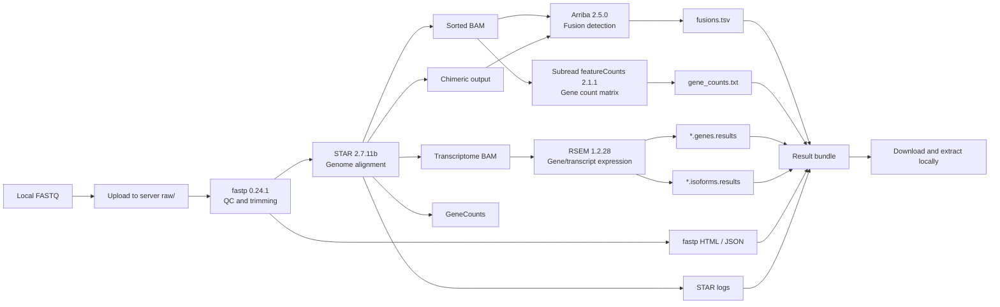

# SYSU RNA-seq Agent

> Conversational model option: the GUI supports an isolated `codex_cli`
> backend. Users can complete the official ChatGPT/Codex device login without
> copying OAuth tokens or storing credentials in `project.json`.

The server tab supports per-user SSH key/agent authentication and temporary
password authentication. Temporary passwords remain in process memory only and
are never written to project configuration or command logs.

This project starts an interactive RNA-seq analysis agent from scratch. The current version can validate local FASTQ files, upload them to a remote server, generate remote pipeline scripts for `fastp`, `STAR`, `Arriba`, `featureCounts`, and `RSEM`, submit the job through `slurm`, `pbs`, or a remote background shell, poll job state, download result bundles, and send email notifications.

Author: Qi Zhao <zhaoqi@sysucc.org.cn>

## Current Capabilities

- Interactive wizard with step-by-step progress.
- One-time default reference setup for GENCODE human release 47.
- Per-project local FASTQ, server, polling, notification, and pipeline configuration.
- Runtime estimate based on sample count, read depth, selected steps, and thread count.
- Local FASTQ validation before upload.
- Privacy-preserving, read-only HPC preflight for scheduler, tools, references,
  work-directory access, storage, and login-shell permissions.
- Upload command generation for transferring local FASTQ files to the server.
- End-to-end `run` command for validate -> upload -> submit -> poll -> download.
- `status` command for refreshing current remote state.
- Email notification settings stored in the project config.
- JSON configuration only for now, so the tool runs with the Python standard library.

## Analysis Workflow



## Assumptions

- The local machine can access the server with `ssh` and `scp`.
- The server has `bash`, `tar`, and the configured RNA-seq tools in `PATH`, or can expose them through `init_commands`.
- Reference files and indexes already exist on the server and their paths are correct in the saved defaults.
- `slurm`, `pbs`, or plain remote shell execution is available, matching `server.scheduler`.

## Usage

Full Chinese usage guide: [docs/usage.md](docs/usage.md)

Project flow diagrams: [docs/flow.md](docs/flow.md)

LLM tool permission model: [docs/llm_tool_permission_model.md](docs/llm_tool_permission_model.md)

Testing and numerical evaluation roadmap: [docs/testing_and_evaluation_roadmap.md](docs/testing_and_evaluation_roadmap.md)

From this repository without installation:

```powershell
$env:PYTHONPATH = "src"
python -m rnaseq_agent gui
```

Or install it in editable mode:

```powershell
python -m pip install -e .
rnaseq-agent gui
```

Recommended flow:

```powershell
$env:PYTHONPATH = "src"
python -m rnaseq_agent gui
python -m rnaseq_agent run runs/<project_id>/project.json
```

Before the first run on an institutional server, use the read-only preflight:

```powershell
$env:PYTHONPATH = "src"
python -m rnaseq_agent preflight runs/<project_id>/project.json
```

The preflight executes one fixed discovery probe. It does not run
`init_commands`, upload or download files, create remote directories, or submit
a job. Its local JSON report omits the server address, username, home directory,
raw remote output, and full command; only a hostname SHA-256 is retained for
environment identity comparison.

`gui` is the recommended entry for most users. It opens a desktop form, validates the fields, and writes `runs/<project_id>/project.json`.
The GUI can also run the analysis directly with "Save and Run", submit without waiting, and refresh remote status.

Use `report` to generate a Markdown summary for a saved project:

```powershell
$env:PYTHONPATH = "src"
python -m rnaseq_agent report runs/<project_id>/project.json
```

The report is written to `runs/<project_id>/report.md` by default, and it summarizes project config, status, logs, and downloaded result files when available.

Use `chat` as the project-session assistant. It can create or open a project,
validate input, run the workflow, refresh status, generate reports, and explain
the expected output artifacts.

### Optional LLM connection

The chat assistant works without a model by using local rule routing. To enable
natural-language intent routing, connect any OpenAI-compatible chat endpoint:

```powershell
$env:RNASEQ_AGENT_LLM_BASE_URL = "https://your-provider.example/v1"
$env:RNASEQ_AGENT_LLM_MODEL = "your-model-name"
$env:RNASEQ_AGENT_LLM_API_KEY = "your-api-key"
$env:PYTHONPATH = "src"
python -m rnaseq_agent chat
```

For a local OpenAI-compatible server, the API key may be left empty. The model
can only select a fixed allowlist of project actions. It does not generate or
execute arbitrary shell commands. Model-triggered run actions require explicit
user confirmation.

Desktop users can configure the same connection in the GUI's `模型` tab and
talk to the agent in the `对话助手` tab. The API key is kept only in the
current process and is not written to `project.json` or the saved defaults.
Use `拉取模型` to query `<Base URL>/models` and select one of the model IDs
available to the current API key. For OpenAI, use `https://api.openai.com/v1`;
ChatGPT web URLs are not API endpoints.
The client supports both Chat Completions and Responses API modes. With
`api_mode=auto`, the local CC Switch gateway at `127.0.0.1:15721` uses
`/responses`. Protocol compatibility does not grant access to Codex OAuth:
CC Switch's official Codex route still expects credentials supplied internally
by the Codex client, so other desktop applications should use an independent
API provider/key or a local model service.
See `docs/model_setup.md` for details.

## MVP: capability-aware auditable session (v0.3)

The MVP introduces a conversational, auditable session layer on top of the
existing execution engine. It implements the "讨论、确认、执行、回滚、继续"
loop from the architecture design: the user and the agent agree on a draft,
the plan is frozen into an immutable Analysis Contract, and every change is
recorded as a ChangeSet with full config snapshots.

### State machine

```
idle -> drafting -> planned -> confirmed -> executing -> completed | failed
                 ^   |   ^   |   ^
                 |   +---+   +---+  (edit / rollback record a ChangeSet
                 +---------------+   and return to drafting)
```

- `drafting`: a project config exists but is not final. `edit` and `rollback`
  are available; every change is appended to `changesets.jsonl` with the
  `previous_config` / `new_config` snapshots and a sha256 fingerprint.
- `planned`: `build_execution_plan()` materializes a deterministic step list.
- `confirmed`: the plan is frozen into `analysis_contract.json`; `edit` is
  rejected to preserve auditability. `rollback` returns to the pre-freeze
  draft so parameters can be changed and re-confirmed.
- `executing`: the plan is submitted through the existing execution gateway
  (`run_agent.run_project`, local / slurm / pbs).

### CLI

```powershell
$env:PYTHONPATH = "src"

# List registered capabilities (Gate-A input contracts)
python -m rnaseq_agent.mvp_cli caps

# Create a project draft (prompts minimal questions)
python -m rnaseq_agent.mvp_cli new

# Resume / inspect
python -m rnaseq_agent.mvp_cli open <project-dir>
python -m rnaseq_agent.mvp_cli history --project-dir <project-dir>

# The core loop
python -m rnaseq_agent.mvp_cli plan     --project-dir <project-dir>
python -m rnaseq_agent.mvp_cli confirm  --project-dir <project-dir>
python -m rnaseq_agent.mvp_cli edit     --project-dir <project-dir>   # records ChangeSet, back to drafting
python -m rnaseq_agent.mvp_cli rollback --project-dir <project-dir>   # stack-based undo of the last change
python -m rnaseq_agent.mvp_cli run      --project-dir <project-dir>   # execute through the gateway
python -m rnaseq_agent.mvp_cli status   --project-dir <project-dir>
python -m rnaseq_agent.mvp_cli report   --project-dir <project-dir>
```

Default project directory is `runs/mvp_demo`; pass `--project-dir` to use
another location.

### Design contract

- The LLM is never asked to produce shell commands. The CLI drives the same
  `ProjectSession` state machine directly; tool execution happens only through
  registered capabilities and the execution gateway.
- Gate-A is a metadata-only suitability check: layout, sample count, design
  (≤ 2 groups in this MVP), required sample fields, reference settings, and
  file presence. A failing draft returns `NOT_EVALUABLE` so the session can
  explain why the request cannot proceed.
- `confirm` reuses the existing `create_project_contract` freeze mechanism:
  the workflow / inputs / scripts sections are fingerprinted with sha256.

### Audit trail

Every project directory contains:

- `project.json` — the current config snapshot.
- `session.json` — session state (`state`, `capability_id`, serialized plan).
- `changesets.jsonl` — append-only audit log. Each `changeset_applied` entry
  stores the patch, the user note, and the full before/after config snapshots
  with sha256 hashes, so any step can be reproduced or reverted.

## Framework alignment (v0.3, design spec 2026-08-20)

The MVP is rebuilt along the design document's call chain:

```
Registry -> Gate-A -> Adapter.inspect/plan -> user confirm
-> Analysis Contract -> Adapter.materialize -> Execution Gateway
-> HPC -> Output Validator -> Post-run Gate -> Artifact Registry
```

Capability IDs follow the frozen slots (framework 15.2):

- `workflow.bulk_rna.grch38_pe_expression_fusion` — GRCh38 paired-end bulk
  RNA expression + fusion golden route (fastp -> STAR -> featureCounts +
  RSEM -> Arriba).

Status vocabulary matches framework 6.3: `NOT_EVALUABLE` (input cannot
proceed), `ABSTAIN` (module refuses to conclude), `FAIL_OUTPUT_CONTRACT`
(artifact missing / schema invalid), `WAITING_USER` (QC checkpoint),
`STALE` (upstream change invalidates an artifact), and the session states.

New modules:

- `src/rnaseq_agent/adapter.py` — `adapter_inspect` (read-only deep
  pre-check), `adapter_plan` (builds the plan the user confirms; a failed
  inspection marks it NOT_EVALUABLE instead of raising), `adapter_materialize`
  (renders the frozen scripts after confirm).
- `src/rnaseq_agent/output_validator.py` — Output Validator (schema/hash
  checks, raises `FAIL_OUTPUT_CONTRACT`), Post-run Gate (QC/OOD refusal ->
  `ABSTAIN`), Artifact Registry (registration + `STALE` invalidation).
- `src/rnaseq_agent/agent_graph.py` — LangGraph control plane
  (framework 5.6). `BulkRNAGraph` drives the audited session; nodes mark
  scientific decision boundaries. A QC checkpoint uses a LangGraph
  `interrupt` (framework 6.1 checkpoint #4).
- `src/rnaseq_agent/webapp.py` — localhost web workbench (framework 11,
  phase-1 single-user): project / flow / audit / decision panels.

### Localhost web workbench

```powershell
# Requires the optional control-plane deps:
pip install "langgraph>=0.2" fastapi uvicorn jinja2
# or: pip install -e .[control-plane]

$env:PYTHONPATH = "src"
python -m rnaseq_agent.webapp            # serves 127.0.0.1:8000
# or
python -m rnaseq_agent.cli web --project-dir runs/mvp_web --port 8000
```

The server binds loopback only and issues a random session token; API
calls without the token are rejected (framework 12.1).

## Agent vs Traditional Software

This project has a GUI, but its core is still an agent-style workflow:

- Configuration is stored as explicit, reusable JSON rather than hidden GUI state.
- Every run generates scripts, logs, status files, and downloadable artifacts for auditing.
- The GUI, chat mode, and CLI all drive the same execution engine.
- The analysis workflow can be extended to other pipelines without redesigning the interface.
- It orchestrates local data, remote execution, polling, download, and notification instead of only running local actions.

## Reproducible execution modes

The execution core now distinguishes three benchmarkable modes:

- `free`: editable project configuration; this does not permit arbitrary LLM-generated shell execution.
- `skill`: a versioned, repository-defined RNA-seq workflow profile.
- `contract`: an explicitly approved immutable contract over workflow settings, FASTQ SHA-256 values, and rendered script SHA-256 values.

Two pinned public benchmarks are also included under `benchmarks/datasets/`:

- a miniature GSE110004 yeast 3-vs-3 set for fast end-to-end smoke tests;
- a Griffith UHR/HBR 3-vs-3 chr22 set with 92 ERCC spike-ins for quantitative
  truth diagnostics.

The downloaded data stay under the gitignored `runs/` directory. Dataset lock
files record sizes and SHA-256 values, and `benchmarks/ercc_metrics.py` reports
ERCC coverage, correlation, log-ratio error, and direction accuracy without
claiming to replace DESeq2/edgeR inference. See
[`benchmarks/README.md`](benchmarks/README.md) for the protocol and limitations.

Useful commands:

```powershell
$env:PYTHONPATH = "src"
python -m rnaseq_agent profiles
python -m rnaseq_agent apply-profile runs/<project_id>/project.json bulk_rnaseq_expression_v1
python -m rnaseq_agent contract create runs/<project_id>/project.json
python -m rnaseq_agent contract verify runs/<project_id>/project.json
```

Contract-mode runs refuse to contact the remote server when the approved inputs, workflow, or scripts have drifted. The approved contract is copied into the generated script bundle and archived with remote results. See [docs/reproducibility_contract.md](docs/reproducibility_contract.md) for semantics and current limitations.

Every submission now receives an independent UTC-based `run_id`. Local and
remote artifacts are written under `attempts/<run_id>/`, so a rerun cannot
inherit an older completion flag or overwrite the previous scripts and logs.
Remote attempt directories default to `umask 077`, directories mode `700`, and
uploaded inputs/support files mode `600`.
Each attempt contains an immutable project snapshot and `run_manifest.json`
with workflow, input, and rendered-script fingerprints. After download, the
agent safely extracts the archive, rejects path traversal and links, writes a
SHA-256 `result_manifest.json`, and checks the key outputs required by each
enabled workflow step before declaring the run complete.

If you want to inspect the individual steps first:

```powershell
$env:PYTHONPATH = "src"
python -m rnaseq_agent validate-local runs/<project_id>/project.json
python -m rnaseq_agent upload-command runs/<project_id>/project.json
python -m rnaseq_agent estimate runs/<project_id>/project.json
python -m rnaseq_agent status runs/<project_id>/project.json
```

The wizard writes the project configuration, and each `run` creates an isolated attempt:

- User defaults: `%USERPROFILE%/.sysu_rnaseq_agent/defaults.json`
- Project config: `runs/<project_id>/project.json`
- Run snapshot: `runs/<project_id>/attempts/<run_id>/project.snapshot.json`
- Run manifest: `runs/<project_id>/attempts/<run_id>/run_manifest.json`
- Generated remote scripts: `runs/<project_id>/attempts/<run_id>/generated_scripts/`
- Agent logs: `runs/<project_id>/attempts/<run_id>/agent_logs/`
- Downloaded bundle: `runs/<project_id>/attempts/<run_id>/downloads/downloads_bundle.tar.gz`
- Extracted results: `runs/<project_id>/attempts/<run_id>/downloads/extracted/`
- Result manifest: `runs/<project_id>/attempts/<run_id>/result_manifest.json`

## RNA-seq Reference Defaults

The default reference follows the requested GENCODE Human Release 47 files:

- GTF: `gencode.v47.chr_patch_hapl_scaff.annotation.gtf.gz`
- FASTA: `GRCh38.p14.genome.fa.gz`
- Assembly: `GRCh38.p14`
- Region set: `ALL`

`ALL` matches the screenshot selection and includes reference chromosomes, scaffolds, assembly patches, and alternate loci. For smaller routine expression workflows, a future preset can add the primary assembly option.

## Notes

- For HPC environments that require `module load` or `conda activate`, fill `server.init_commands` in the wizard.
- `run` blocks until completion by default. Use `--no-wait` to return after submission:

```powershell
$env:PYTHONPATH = "src"
python -m rnaseq_agent run runs/<project_id>/project.json --no-wait
```

- The downloaded result is saved as a `.tar.gz` bundle and automatically extracted under `downloads/extracted/`.

## Planned Next Steps

1. Wire the LLM chat layer to the MVP session (`chat.py` currently routes to
   the classic one-shot `run`; it should emit structured capability requests
   that feed `ProjectSession` instead).
2. Verify uploaded FASTQ checksums and lock remote reference/index checksums.
3. Bind actual tool versions to the analysis contract or an Apptainer digest.
4. Add semantic count-matrix/DEG consistency metrics beyond ERCC diagnostics
   and exact file hashes.
5. Add scheduler accounting, resource-usage capture, and resumable steps.
6. Add a native `claw` backend as an alternative to `ssh` and `scp`.
