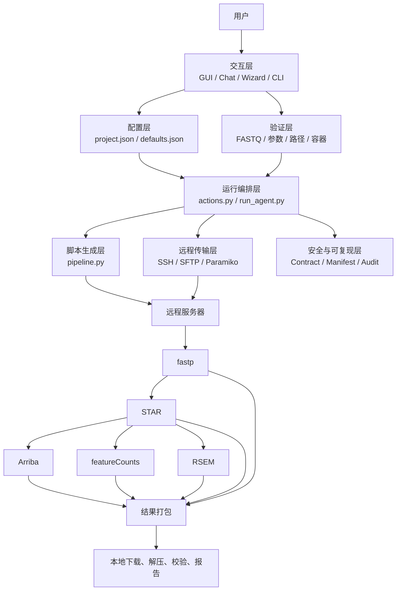
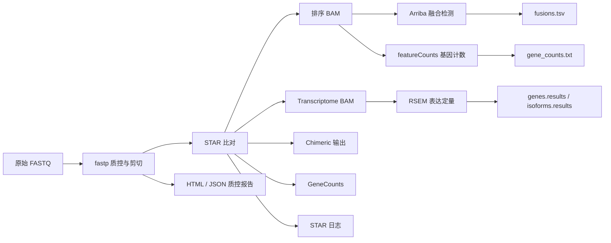

# SysuccRNAseqAgent 历史对话导出

来源：本地会话 019ff402-41f5-72b2-a32c-08083c4beb54。仅导出保存的用户与助手消息，不包含工具输出、系统指令。

## user — 08/12/2026 03:27:50

你能拉取我的仓库[https://github.com/yeyulin0504/SysuccRNAseqAgent，](https://github.com/yeyulin0504/SysuccRNAseqAgent，)我们在这个仓库 的main分支基础上进行修改改版吗

## assistant — 08/12/2026 03:28:01

可以。我会先检查当前工作目录，然后把仓库的 `main` 分支克隆到独立子目录，并确认分支与远程地址，避免覆盖现有文件。

## assistant — 08/12/2026 03:28:09

当前目录只有系统生成的 `work` 和 `outputs`，没有冲突。我现在将仓库克隆到 `work/SysuccRNAseqAgent`，以 `main` 为工作基线。

## assistant — 08/12/2026 03:28:47

当前 PowerShell 环境的 `PATH` 里没有 Git。我会先定位机器上已有的 Git 可执行文件；如果确实未安装，再采用不依赖 Git 的下载方式，并说明后续提交能力的差异。

## assistant — 08/12/2026 03:29:43

可以，仓库已成功拉取：

- 本地路径：`C:\Users\Administrator\Documents\Codex\2026-08-12\ni\work\SysuccRNAseqAgent`
- 当前分支：`main`
- 已与 `origin/main` 同步
- 基准提交：`c7d241e feat: establish guarded RNA-seq analysis baseline`

接下来告诉我具体需要如何改版即可。我会以 `main` 为基础创建开发分支进行修改，避免直接污染主分支。

## user — 08/12/2026 03:30:21

好，那这个项目怎么形成一下

## assistant — 08/12/2026 03:30:44

我理解你是想让我把这个项目“运行起来”并检查是否正常。我先查看项目说明、依赖和启动入口，再按仓库推荐方式启动验证。

## assistant — 08/12/2026 03:30:55

项目是 Python 3.11+ 的桌面 RNA-seq 工作流工具，推荐入口是 GUI。接下来我会创建项目独立虚拟环境、安装依赖、运行测试，然后启动界面；这些操作不会修改业务源码。

## assistant — 08/12/2026 03:32:11

虚拟环境已经建立，依赖安装仍在进行。我会等安装完成后立即跑自动化测试，确认 Python 3.13 在这个项目上没有兼容问题。

## assistant — 08/12/2026 03:33:08

测试共 170 项，167 项通过；3 项失败都来自 Windows 临时目录长路径与 `ADMINI~1` 短路径表现不一致，不是 RNA-seq 业务流程错误。我再做一次命令入口检查，并启动可见的桌面 GUI。

## assistant — 08/12/2026 03:33:58

项目已经运行起来了，桌面 GUI 当前正在运行（PID 25336），应该已经弹出窗口。

当前情况：

- 已创建独立 Python 虚拟环境并安装全部依赖
- 命令行入口正常
- 170 项测试中 167 项通过
- 3 项失败是 Windows 临时目录长路径与 `ADMINI~1` 短路径比较问题，不影响主要功能
- 没有修改 `main` 分支源码

以后可以这样启动：

```powershell
cd C:\Users\Administrator\Documents\Codex\2026-08-12\ni\work\SysuccRNAseqAgent
.\.venv\Scripts\python.exe -m rnaseq_agent gui
```

项目的基本流程是：配置本地 FASTQ → 配置远程服务器 → 执行只读环境检查 → 上传数据 → 提交 RNA-seq 分析 → 下载结果并生成报告。

接下来可以直接开始界面和功能改版。

## user — 08/12/2026 08:24:22

可以的，现在我想知道我这个项目的基本框架以及具体的工作流流程

## assistant — 08/12/2026 08:24:46

我会先按项目现有源码和文档梳理两条线：一条是代码分层与模块职责，另一条是从配置到远程分析、结果回收的实际执行链路。然后用一张简化架构图和分步骤流程说明，避免只停留在文件列表层面。

## assistant — 08/12/2026 08:25:41

我会用项目源码作为依据，重点阅读 `README`、`docs/flow.md`、CLI 入口、GUI、执行引擎、远程传输和结果归档模块；这能把“项目有哪些文件”与“用户一次运行到底发生什么”对应起来。

## assistant — 08/12/2026 08:29:02

这个项目本质上是一个“RNA-seq 分析流程编排器”，不是在本地直接运行 `fastp`、`STAR` 等工具。它负责收集配置、验证数据、通过 SSH/SFTP 把数据和脚本发送到服务器、提交 HPC 任务、轮询状态，再把结果下载回来并进行完整性校验。

项目代码位于：

`C:\Users\Administrator\Documents\Codex\2026-08-12\ni\work\SysuccRNAseqAgent`

## 一、整体架构



## 二、代码模块分层

### 1. 交互入口层

主要文件：

- [`cli.py`](/C:/Users/Administrator/Documents/Codex/2026-08-12/ni/work/SysuccRNAseqAgent/src/rnaseq_agent/cli.py)
- [`gui.py`](/C:/Users/Administrator/Documents/Codex/2026-08-12/ni/work/SysuccRNAseqAgent/src/rnaseq_agent/gui.py)
- [`chat.py`](/C:/Users/Administrator/Documents/Codex/2026-08-12/ni/work/SysuccRNAseqAgent/src/rnaseq_agent/chat.py)
- [`wizard.py`](/C:/Users/Administrator/Documents/Codex/2026-08-12/ni/work/SysuccRNAseqAgent/src/rnaseq_agent/wizard.py)

支持四种入口：

```text
gui      桌面图形界面，推荐普通用户使用
chat     对话式配置和操作
wizard   命令行交互式向导
CLI      estimate、validate、run、status、report 等命令
```

这些入口主要负责和用户交互，真正的分析逻辑由下面的公共执行层完成。

### 2. 配置层

主要文件：

- [`configuration.py`](/C:/Users/Administrator/Documents/Codex/2026-08-12/ni/work/SysuccRNAseqAgent/src/rnaseq_agent/configuration.py)
- [`defaults.py`](/C:/Users/Administrator/Documents/Codex/2026-08-12/ni/work/SysuccRNAseqAgent/src/rnaseq_agent/defaults.py)
- [`storage.py`](/C:/Users/Administrator/Documents/Codex/2026-08-12/ni/work/SysuccRNAseqAgent/src/rnaseq_agent/storage.py)

核心配置文件是：

```text
runs/<project_id>/project.json
```

其中保存：

- 项目基本信息
- 服务器地址、用户名、调度器
- 本地 FASTQ 路径
- 样本和分组信息
- 参考基因组路径
- RNA-seq 流程开关
- 线程、内存
- 轮询参数
- 邮件通知配置
- 执行模式和运行状态

用户级别的固定默认值保存于：

```text
%USERPROFILE%/.sysu_rnaseq_agent/defaults.json
```

例如参考基因组路径和服务器公共目录，不需要每个项目重复填写。

### 3. 数据验证层

主要文件：

- [`validation.py`](/C:/Users/Administrator/Documents/Codex/2026-08-12/ni/work/SysuccRNAseqAgent/src/rnaseq_agent/validation.py)
- [`safety.py`](/C:/Users/Administrator/Documents/Codex/2026-08-12/ni/work/SysuccRNAseqAgent/src/rnaseq_agent/safety.py)
- [`container.py`](/C:/Users/Administrator/Documents/Codex/2026-08-12/ni/work/SysuccRNAseqAgent/src/rnaseq_agent/container.py)
- [`preflight.py`](/C:/Users/Administrator/Documents/Codex/2026-08-12/ni/work/SysuccRNAseqAgent/src/rnaseq_agent/preflight.py)

验证内容包括：

- FASTQ 文件是否存在
- 路径是否越界
- 文件是否重复使用
- gzip 是否损坏或截断
- FASTQ 是否满足四行记录结构
- R1/R2 数量是否一致
- R1/R2 read ID 是否匹配
- 样本 ID 是否安全
- 是否至少启用了一个分析步骤
- 参考基因组和索引路径是否安全
- Apptainer/Singularity 配置是否完整
- 下游分析的 count matrix 和 metadata 是否匹配

`preflight` 是远程服务器的只读检查，主要检查：

- Slurm、PBS 或普通 shell 是否可用
- `fastp`、`STAR`、`Arriba`、`featureCounts`、`RSEM` 是否可用
- 参考文件和索引是否存在
- 工作目录是否有权限
- 存储和环境是否满足要求

它不会上传数据、创建目录或提交任务。

### 4. 流程配置层

主要文件：

- [`workflow_profiles.py`](/C:/Users/Administrator/Documents/Codex/2026-08-12/ni/work/SysuccRNAseqAgent/src/rnaseq_agent/workflow_profiles.py)
- [`estimate.py`](/C:/Users/Administrator/Documents/Codex/2026-08-12/ni/work/SysuccRNAseqAgent/src/rnaseq_agent/estimate.py)
- [`reference_catalog.py`](/C:/Users/Administrator/Documents/Codex/2026-08-12/ni/work/SysuccRNAseqAgent/src/rnaseq_agent/reference_catalog.py)

目前有两个版本化流程：

```text
bulk_rnaseq_expression_v1
fastp -> STAR -> featureCounts

bulk_rnaseq_full_v1
fastp -> STAR -> Arriba + featureCounts + RSEM
```

默认参考配置是：

```text
GENCODE Human Release 47
GRCh38.p14
```

### 5. 运行编排层

核心文件：

- [`actions.py`](/C:/Users/Administrator/Documents/Codex/2026-08-12/ni/work/SysuccRNAseqAgent/src/rnaseq_agent/actions.py)
- [`run_agent.py`](/C:/Users/Administrator/Documents/Codex/2026-08-12/ni/work/SysuccRNAseqAgent/src/rnaseq_agent/run_agent.py)

`run_agent.py` 负责把整个任务串起来：

```text
加载配置
  -> 创建独立 run_id
  -> 保存项目快照
  -> 本地验证
  -> 验证执行策略
  -> 创建远程传输
  -> 上传 FASTQ
  -> 生成远程脚本
  -> 上传脚本
  -> 提交任务
  -> 轮询状态
  -> 下载结果
  -> 安全解压
  -> 生成结果清单
  -> 更新最终状态
  -> 发送邮件
```

### 6. 远程连接层

主要文件：

- [`remote_transport.py`](/C:/Users/Administrator/Documents/Codex/2026-08-12/ni/work/SysuccRNAseqAgent/src/rnaseq_agent/remote_transport.py)
- [`remote.py`](/C:/Users/Administrator/Documents/Codex/2026-08-12/ni/work/SysuccRNAseqAgent/src/rnaseq_agent/remote.py)
- [`ssh_auth.py`](/C:/Users/Administrator/Documents/Codex/2026-08-12/ni/work/SysuccRNAseqAgent/src/rnaseq_agent/ssh_auth.py)

支持三种认证方式：

```text
key       SSH 私钥或 ssh-agent
password  本次进程内临时密码
system    系统 OpenSSH 配置
```

密码不会保存到：

- `project.json`
- 默认配置
- 命令日志

远程传输支持：

```text
SSH 执行命令
SCP 上传和下载
Paramiko 密码登录和 SFTP
```

服务器调度方式支持：

```text
slurm
pbs
local/后台 shell
```

### 7. 脚本生成层

主要文件：

- [`pipeline.py`](/C:/Users/Administrator/Documents/Codex/2026-08-12/ni/work/SysuccRNAseqAgent/src/rnaseq_agent/pipeline.py)

每次运行都会动态生成脚本，例如：

```text
env_setup.sh
run_pipeline.sh
submit.sbatch
submit.pbs
submit.sh
```

脚本中包含：

- 环境初始化
- 工作目录创建
- FASTQ 输入路径
- 工具调用参数
- 线程和资源设置
- 结果目录
- 成功/失败状态标记
- 容器包装命令

## 三、完整 RNA-seq 工作流

### 第 1 步：创建项目

用户从 GUI、Chat、Wizard 或手工 JSON 开始，填写：

- 项目 ID
- 项目名称
- 服务器信息
- 本地 FASTQ 目录
- 样本名称和分组
- 测序类型
- 参考基因组
- 运行工具
- 资源参数

之后生成：

```text
runs/<project_id>/project.json
```

### 第 2 步：估算运行时间

程序根据以下因素估计耗时：

- 样本数
- 每个样本的测序量
- 是否启用 fastp
- 是否启用 STAR
- 是否启用 Arriba
- 是否启用 featureCounts
- 是否启用 RSEM
- 线程数

对应命令：

```powershell
python -m rnaseq_agent estimate runs/<project_id>/project.json
```

### 第 3 步：本地 FASTQ 验证

执行：

```powershell
python -m rnaseq_agent validate-local runs/<project_id>/project.json
```

只有验证通过后，才会继续上传和远程分析。

### 第 4 步：远程环境预检

建议首次连接服务器时执行：

```powershell
python -m rnaseq_agent preflight runs/<project_id>/project.json
```

这一步只读检查远程环境，不产生分析任务。

### 第 5 步：创建独立运行目录

每次 `run` 都会生成独立的 UTC `run_id`：

```text
runs/<project_id>/attempts/<run_id>/
```

这样重复运行不会覆盖之前的脚本、日志和结果。

同时保存：

```text
project.snapshot.json
run_manifest.json
```

### 第 6 步：上传 FASTQ

远程目录通常类似：

```text
<remote_base_dir>/<project_id>/attempts/<run_id>/raw/
```

上传时会：

- 创建远程目录
- 上传 FASTQ
- 设置目录权限为 `700`
- 设置数据文件权限为 `600`

### 第 7 步：生成和上传远程脚本

本地生成：

```text
generated_scripts/env_setup.sh
generated_scripts/run_pipeline.sh
generated_scripts/submit.sbatch
```

然后上传到服务器的：

```text
scripts/
```

### 第 8 步：服务器执行 RNA-seq 分析

默认完整流程如下：



各工具作用：

- `fastp`：质量控制、接头处理、低质量序列过滤
- `STAR`：将 reads 比对到参考基因组
- `Arriba`：检测候选融合基因
- `featureCounts`：生成基因层面的 count 矩阵
- `RSEM`：基因和转录本表达定量

### 第 9 步：任务状态轮询

程序读取远程目录中的状态文件，例如：

```text
status/state.txt
status/running.flag
status/completed.flag
status/failed.flag
```

本地项目状态会逐步变化：

```text
configured
  -> preparing
  -> validated
  -> uploaded
  -> submitted
  -> remote_completed
  -> results_verified
  -> completed
```

失败时可能进入：

```text
validation_failed
policy_failed
upload_failed
run_failed
download_failed
result_validation_failed
timeout
```

### 第 10 步：下载和安全解压结果

远程任务结束后生成：

```text
downloads_bundle.tar.gz
```

本地保存到：

```text
runs/<project_id>/attempts/<run_id>/downloads/
```

之后解压到：

```text
downloads/extracted/
```

解压过程会拒绝：

- 绝对路径
- `../` 路径穿越
- Windows 反斜杠绕过路径
- 符号链接
- 非法归档成员

### 第 11 步：结果清单验证

主要文件：

- [`result_manifest.py`](/C:/Users/Administrator/Documents/Codex/2026-08-12/ni/work/SysuccRNAseqAgent/src/rnaseq_agent/result_manifest.py)
- [`archive.py`](/C:/Users/Administrator/Documents/Codex/2026-08-12/ni/work/SysuccRNAseqAgent/src/rnaseq_agent/archive.py)

程序会检查关键结果是否存在、是否为空，并记录 SHA-256：

```text
result_manifest.json
```

例如完整流程至少会检查：

```text
fastp/*.html
fastp/*.json
star/*.Aligned.sortedByCoord.out.bam
star/*.Log.final.out
arriba/*.fusions.tsv
featurecounts/gene_counts.txt
rsem/*.genes.results
rsem/*.isoforms.results
status/completed.flag
```

只有结果校验通过，项目才会进入 `completed`。

### 第 12 步：报告和通知

报告模块：

- [`report.py`](/C:/Users/Administrator/Documents/Codex/2026-08-12/ni/work/SysuccRNAseqAgent/src/rnaseq_agent/report.py)
- [`emailer.py`](/C:/Users/Administrator/Documents/Codex/2026-08-12/ni/work/SysuccRNAseqAgent/src/rnaseq_agent/emailer.py)

生成报告：

```powershell
python -m rnaseq_agent report runs/<project_id>/project.json
```

输出：

```text
runs/<project_id>/report.md
```

报告包括：

- 项目和样本信息
- 参考基因组
- 分析步骤
- 运行状态
- Job ID
- 运行日志
- 结果文件
- 下游分析摘要
- 结果指纹

## 四、下游差异表达流程

项目还支持从已有 count matrix 开始的独立下游分析。

这种模式不再上传 FASTQ，而是：

```text
count matrix + sample metadata
    -> 本地验证
    -> 上传 counts.tsv 和 metadata.tsv
    -> 运行下游脚本
    -> 过滤和标准化
    -> PCA / QC
    -> 差异表达
    -> 对比结果和 DEG 表
```

相关模块：

- [`downstream.py`](/C:/Users/Administrator/Documents/Codex/2026-08-12/ni/work/SysuccRNAseqAgent/src/rnaseq_agent/downstream.py)
- [`downstream_inputs.py`](/C:/Users/Administrator/Documents/Codex/2026-08-12/ni/work/SysuccRNAseqAgent/src/rnaseq_agent/downstream_inputs.py)
- [`downstream_artifacts.py`](/C:/Users/Administrator/Documents/Codex/2026-08-12/ni/work/SysuccRNAseqAgent/src/rnaseq_agent/downstream_artifacts.py)

下游结果包括：

```text
downstream/summary.json
downstream/count_filter_audit.csv
downstream/id_mapping_audit.csv
downstream/vst_counts.csv
downstream/qc/pca.csv
downstream/de/<contrast>_results.csv
downstream/de/<contrast>_deg.csv
```

## 五、可复现和安全机制

项目有三种执行模式：

```text
free
配置可编辑，但不允许模型自由生成和执行任意 shell 命令

skill
使用仓库中固定版本的流程 profile

contract
冻结输入文件、流程配置和脚本 SHA-256，运行前检查是否发生漂移
```

对应模块：

- [`analysis_contract.py`](/C:/Users/Administrator/Documents/Codex/2026-08-12/ni/work/SysuccRNAseqAgent/src/rnaseq_agent/analysis_contract.py)
- [`workflow_profiles.py`](/C:/Users/Administrator/Documents/Codex/2026-08-12/ni/work/SysuccRNAseqAgent/src/rnaseq_agent/workflow_profiles.py)

Contract 模式的目的，是保证：

```text
批准时的 FASTQ
批准时的流程
批准时生成的脚本
```

和真正执行时完全一致。

## 六、项目目录和运行产物

一次典型运行大致会产生：

```text
runs/
└── <project_id>/
    ├── project.json
    ├── report.md
    ├── analysis_contract.json
    ├── attempts/
    │   └── <run_id>/
    │       ├── project.snapshot.json
    │       ├── run_manifest.json
    │       ├── generated_scripts/
    │       │   ├── env_setup.sh
    │       │   ├── run_pipeline.sh
    │       │   └── submit.sbatch
    │       ├── agent_logs/
    │       │   ├── events.jsonl
    │       │   └── commands.jsonl
    │       └── downloads/
    │           ├── downloads_bundle.tar.gz
    │           ├── extracted/
    │           └── result_manifest.json
```

## 七、一句话概括

这个项目的核心流程是：

```text
用户配置项目
  -> 本地严格验证
  -> 可选远程只读预检
  -> 生成可审计脚本
  -> SSH/SFTP 上传数据和脚本
  -> Slurm/PBS/后台 Shell 执行 RNA-seq
  -> 轮询任务状态
  -> 下载并安全解压结果
  -> 校验关键文件和哈希
  -> 生成报告并发送通知
```

因此，它的定位更接近：

```text
桌面配置工具 + HPC 任务编排器 + RNA-seq 脚本生成器 + 结果审计系统
```

而不是单纯的命令行分析脚本。

## user — 08/12/2026 09:17:03

我有问题 ，它支持从GUI上次fastq文件，由它上传到服务器吗？


## assistant — 08/12/2026 09:17:29

支持。我再核对一下 GUI 中“仅上传 FASTQ”和“保存并运行”两个按钮的实际行为，确保把上传前提、上传位置和是否会提交分析任务说准确。

## assistant — 08/12/2026 09:17:45

支持，而且这是 GUI 的核心功能之一。

在 GUI 底部有两个相关按钮：

- `仅上传 FASTQ`：检查本地 FASTQ 后，通过 SSH/SFTP 上传到服务器；不会生成分析脚本，也不会提交 Slurm/PBS 任务。
- `保存并运行`：保存配置 → 上传 FASTQ → 生成分析脚本 → 提交任务 → 轮询状态 → 下载结果。

使用方式：

1. 在“样本/测序”页点击“选择目录”，选择本机 FASTQ 所在文件夹。
2. 在样本表填写每个样本的 `sample_id, condition, fastq_1, fastq_2`。
3. 在“服务器”页填写服务器地址、用户名、远程项目根目录，并选择 SSH 密钥、系统 SSH 或临时密码登录。
4. 在“样本/测序”页设置“服务器接收 FASTQ 目录”：
   - 填 `AUTO`：自动上传到 `<远程项目目录>/raw`
   - 或手工填服务器绝对路径。
5. 点击 `仅上传 FASTQ`，确认目标目录后开始传输。

上传前它会完整检查 FASTQ 的 gzip 完整性、四行结构、双端 R1/R2 记录数和 read ID 是否匹配。检查不通过不会上传。

注意：若服务器上已有同名 FASTQ 文件，`仅上传 FASTQ` 会替换它。建议首次使用先点“测试连接”，再执行只读的 `preflight` 检查服务器环境。

## user — 08/12/2026 09:21:02

如果支持那是怎么做到的，想看具体实现代码


## assistant — 08/12/2026 09:21:13

可以。我会沿着 GUI 点击事件 → 本地验证 → SSH/SFTP 传输 → 状态回写这条调用链，把关键代码摘出来并逐段说明。

## assistant — 08/12/2026 09:23:04

支持，关键实现链路是：

```text
GUI“仅上传 FASTQ”
    -> start_upload()
    -> build_config()
    -> validate_local_fastqs()
    -> 保存 project.json
    -> upload_project_fastqs()
    -> create_remote_transport()
    -> _upload_fastqs()
    -> SSH mkdir
    -> SCP 或 SFTP 上传
    -> 更新状态为 uploaded
```

下面是具体代码。

## 1. GUI 按钮入口

文件：

[`gui.py:2004`](/C:/Users/Administrator/Documents/Codex/2026-08-12/ni/work/SysuccRNAseqAgent/src/rnaseq_agent/gui.py:2004)

```python
def start_upload(self) -> None:
    if self.running:
        messagebox.showinfo(
            "正在处理",
            "已有任务正在处理，请等待当前任务结束。",
        )
        return

    # 准备 SSH 凭证
    if not self._prepare_server_credential(require_password=True):
        return

    try:
        # 从 GUI 表单生成配置字典
        config = self.build_config()

        # 只检查 FASTQ，不检查完整分析流程
        validation = validate_local_fastqs(
            config,
            check_pipeline=False,
        )
    except Exception as exc:
        messagebox.showerror("配置错误", str(exc))
        return

    if not validation.ok:
        messagebox.showerror(
            "FASTQ 校验失败",
            "\n".join(validation_summary(validation)),
        )
        return

    remote_data_dir = config["samples"]["remote_data_dir"]

    confirmed = messagebox.askyesno(
        "确认上传 FASTQ",
        "Agent 将创建远程目录并上传当前 FASTQ：\n\n"
        f"{remote_data_dir}\n\n"
        "此操作不会提交 Slurm 任务。"
        "同名远程文件会被替换。是否继续？",
    )
    if not confirmed:
        return

    # 先保存 project.json
    config_path = self.save_config_silent()

    self.running = True
    self.status_text.set(
        f"正在校验并上传 FASTQ 到 {remote_data_dir}……"
    )

    # 放到后台线程，避免 GUI 界面卡死
    threading.Thread(
        target=self._upload_worker,
        args=(config_path,),
        daemon=True,
    ).start()
```

这里可以看到，GUI 本身不直接执行 `scp`，它只负责：

1. 读取表单；
2. 验证输入；
3. 请求用户确认；
4. 启动后台上传任务。

真正上传由后端执行模块完成。

## 2. 后台线程调用上传服务

文件：

[`gui.py:2040`](/C:/Users/Administrator/Documents/Codex/2026-08-12/ni/work/SysuccRNAseqAgent/src/rnaseq_agent/gui.py:2040)

```python
def _upload_worker(self, config_path: Path) -> None:
    try:
        outcome = upload_project_fastqs(config_path)
    except Exception as exc:
        self.after(
            0,
            self._upload_finished,
            False,
            str(exc),
            config_path,
        )
        return

    self.after(
        0,
        self._upload_finished,
        True,
        outcome.message,
        config_path,
    )
```

`self.after(0, ...)` 是 Tkinter 的线程安全回调方式，用于把后台线程的结果切回 GUI 主线程。

上传完成后：

```python
def _upload_finished(
    self,
    ok: bool,
    message: str,
    config_path: Path,
) -> None:
    self.running = False
    self.current_config_path = config_path
    self.status_text.set(message)

    if ok:
        messagebox.showinfo("FASTQ 上传完成", message)
    else:
        messagebox.showerror("FASTQ 上传失败", message)
```

## 3. 上传服务函数

文件：

[`run_agent.py:51`](/C:/Users/Administrator/Documents/Codex/2026-08-12/ni/work/SysuccRNAseqAgent/src/rnaseq_agent/run_agent.py:51)

```python
def upload_project_fastqs(config_path: Path) -> RunOutcome:
    """
    验证并上传 FASTQ，但不提交分析任务。
    """
    config = normalize_config(load_json(config_path))
    save_json(config_path, config)

    project_dir = config_path.parent
    logs_dir = project_dir / "agent_logs"
    logs_dir.mkdir(parents=True, exist_ok=True)

    _log_event(
        logs_dir,
        "upload_started",
        {"config": str(config_path)},
    )

    try:
        # 只验证 FASTQ，不验证 fastp/STAR 等分析工具
        validation = validate_local_fastqs(
            config,
            check_pipeline=False,
        )

        if not validation.ok:
            parts = []

            if validation.missing_files:
                parts.append(
                    f"{len(validation.missing_files)} 个文件缺失"
                )

            if validation.errors:
                parts.append("; ".join(validation.errors))

            message = "本地 FASTQ 校验失败：" + "，".join(parts)

            _update_status(
                config_path,
                "validation_failed",
                message,
            )

            raise RuntimeError(message)

        # 根据配置创建 SSH/SFTP 传输对象
        transport = create_remote_transport(config)

        # 创建远程目录并上传文件
        _upload_fastqs(
            config,
            logs_dir,
            transport,
        )

        remote_data_dir = config["samples"]["remote_data_dir"]
        message = f"FASTQ 已上传到服务器：{remote_data_dir}"

        _update_status(
            config_path,
            "uploaded",
            message,
        )

        _log_event(
            logs_dir,
            "upload_completed",
            {
                "remote_data_dir": remote_data_dir,
                "files": [
                    path.name
                    for path in collect_local_fastq_paths(config)
                ],
            },
        )

        return RunOutcome(
            "uploaded",
            message,
            project_dir,
        )

    except Exception as exc:
        message = str(exc)

        _update_status(
            config_path,
            "upload_failed",
            message,
        )

        _log_event(
            logs_dir,
            "upload_failed",
            {"message": message},
        )

        raise
```

关键点：

```python
transport = create_remote_transport(config)
_upload_fastqs(config, logs_dir, transport)
```

这两行把“配置”转换成具体的远程传输动作。

## 4. 创建远程目录并上传 FASTQ

文件：

[`run_agent.py:362`](/C:/Users/Administrator/Documents/Codex/2026-08-12/ni/work/SysuccRNAseqAgent/src/rnaseq_agent/run_agent.py:362)

```python
def _upload_fastqs(
    config: dict[str, Any],
    logs_dir: Path,
    transport: RemoteTransport,
) -> None:
    remote_data_dir = config["samples"]["remote_data_dir"]

    # 仅上传模式没有 run.id；
    # 完整分析运行时会有 run.id，并启用更严格权限
    private_attempt = bool(
        config.get("run", {}).get("id")
    )

    # 创建服务器端目录
    mkdir_command = (
        f"mkdir -p {shell_quote(remote_data_dir)}"
    )

    if private_attempt:
        mkdir_command = (
            f"umask 077 && "
            f"{mkdir_command} && "
            f"chmod 700 {shell_quote(remote_data_dir)}"
        )

    result = transport.execute(mkdir_command)
    _log_command(
        logs_dir,
        "Create remote FASTQ directory",
        result,
    )

    # 根据 samples.items 找出所有 FASTQ
    local_paths = collect_local_fastq_paths(config)

    if local_paths:
        # 通过 SCP 或 SFTP 上传
        result = transport.upload(
            local_paths,
            remote_data_dir,
        )

        _log_command(
            logs_dir,
            "Upload local FASTQ files to server",
            result,
        )

        # 完整 run 模式下，将上传文件权限设为 600
        if private_attempt:
            uploaded = " ".join(
                shell_quote(
                    f"{remote_data_dir.rstrip('/')}/{path.name}"
                )
                for path in local_paths
            )

            result = transport.execute(
                f"chmod 600 {uploaded}"
            )

            _log_command(
                logs_dir,
                "Restrict uploaded FASTQ permissions",
                result,
            )
```

这个函数做两件事：

```text
1. SSH 执行 mkdir -p，创建服务器接收目录
2. 调用 transport.upload() 上传所有 FASTQ
```

例如 GUI 里的远程路径是：

```text
/data/users/username/rnaseq_projects/demo_001/raw
```

那么程序实际会先执行：

```bash
ssh username@your.server.edu \
  "mkdir -p /data/users/username/rnaseq_projects/demo_001/raw"
```

然后再把本地文件传过去。

## 5. SSH 密钥模式：使用系统 SCP

文件：

[`remote_transport.py:62`](/C:/Users/Administrator/Documents/Codex/2026-08-12/ni/work/SysuccRNAseqAgent/src/rnaseq_agent/remote_transport.py:62)

```python
class SystemSSHTransport:
    def __init__(
        self,
        server: dict[str, Any],
        credential: SSHCredential,
    ) -> None:
        self.host = str(server["host"])
        self.user = str(server["user"])
        self.port = _server_port(server)
        self.target = f"{self.user}@{self.host}"
        self.credential = credential

    def _scp_options(self) -> list[str]:
        options = [
            "-o",
            "ConnectTimeout=15",
            "-o",
            "BatchMode=yes",
        ]

        if self.credential.mode == "key":
            if self.credential.key_path:
                options.extend(
                    ["-i", self.credential.key_path]
                )

        if self.port != 22:
            options.extend(
                ["-P", str(self.port)]
            )

        return options

    def upload(
        self,
        local_paths: Sequence[Path],
        remote_dir: str,
    ) -> CommandResult:
        sources = [
            str(path).replace("\\", "/")
            for path in local_paths
        ]

        return run_command(
            [
                "scp",
                *self._scp_options(),
                *sources,
                f"{self.target}:{remote_path(remote_dir)}/",
            ]
        )
```

假设：

```text
本地：
D:/data/rnaseq/raw_fastq/Ctrl_1_R1.fastq.gz
D:/data/rnaseq/raw_fastq/Ctrl_1_R2.fastq.gz

远程：
/data/users/user/rnaseq_projects/demo_001/raw
```

最终相当于执行：

```bash
scp \
  D:/data/rnaseq/raw_fastq/Ctrl_1_R1.fastq.gz \
  D:/data/rnaseq/raw_fastq/Ctrl_1_R2.fastq.gz \
  username@server.edu:/data/users/user/rnaseq_projects/demo_001/raw/
```

如果指定了私钥，命令中会增加：

```bash
-i C:/Users/username/.ssh/id_ed25519
```

如果服务器 SSH 端口不是 22，则会增加：

```bash
-P 2222
```

## 6. 临时密码模式：使用 Paramiko SFTP

文件：

[`remote_transport.py:114`](/C:/Users/Administrator/Documents/Codex/2026-08-12/ni/work/SysuccRNAseqAgent/src/rnaseq_agent/remote_transport.py:114)

```python
class ParamikoTransport:
    def __init__(
        self,
        server: dict[str, Any],
        credential: SSHCredential,
    ) -> None:
        self.host = str(server["host"])
        self.user = str(server["user"])
        self.password = credential.password
        self.port = _server_port(server)
        self.target = f"{self.user}@{self.host}"
```

连接服务器：

```python
def _connect(self):
    import paramiko

    client = paramiko.SSHClient()
    client.load_system_host_keys()

    # 拒绝未知主机，不自动接受服务器指纹
    client.set_missing_host_key_policy(
        paramiko.RejectPolicy()
    )

    client.connect(
        hostname=self.host,
        port=self.port,
        username=self.user,
        password=self.password,
        timeout=15,
        auth_timeout=20,
        banner_timeout=20,
        allow_agent=False,
        look_for_keys=False,
    )

    return client
```

上传文件：

```python
def upload(
    self,
    local_paths: Sequence[Path],
    remote_dir: str,
) -> CommandResult:
    uploaded: list[str] = []

    with self._connect() as client:
        sftp = client.open_sftp()

        try:
            for local_path in local_paths:
                destination = (
                    f"{remote_dir.rstrip('/')}/"
                    f"{local_path.name}"
                )

                sftp.put(
                    str(local_path),
                    destination,
                )

                uploaded.append(local_path.name)
        finally:
            sftp.close()

    return CommandResult(
        command=[
            "sftp-upload",
            *(path.name for path in local_paths),
            f"{self.target}:{remote_dir}/",
        ],
        returncode=0,
        stdout="\n".join(uploaded),
        stderr="",
    )
```

也就是说：

```text
密码模式
    -> Paramiko 建立 SSH 连接
    -> 打开 SFTP
    -> 逐个文件 sftp.put()
    -> 关闭 SFTP
```

临时密码只保存在当前 Python 进程内，不会写进项目配置文件。

## 7. 上传前的 FASTQ 验证

文件：

[`validation.py:39`](/C:/Users/Administrator/Documents/Codex/2026-08-12/ni/work/SysuccRNAseqAgent/src/rnaseq_agent/validation.py:39)

```python
def validate_local_fastqs(
    config: dict[str, Any],
    *,
    check_pipeline: bool = True,
) -> ValidationResult:
    samples = config["samples"]
    local_data_dir = Path(
        samples["local_data_dir"]
    )

    resolved_data_dir = local_data_dir.resolve()
    paired = (
        config.get("sequencing", {})
        .get("layout", "paired")
        == "paired"
    )

    missing: list[Path] = []
    checked = 0
    errors = _sample_errors(config)

    for sample in samples.get("items", []):
        keys = (
            ("fastq_1", "fastq_2")
            if paired
            else ("fastq_1",)
        )

        for key in keys:
            fastq = sample.get(key)

            if not fastq:
                continue

            checked += 1

            # 只允许相对文件名
            if relative_filename_error(fastq, key):
                continue

            path = (
                resolved_data_dir / str(fastq)
            ).resolve()

            # 防止 ../../ 越出 FASTQ 根目录
            try:
                path.relative_to(
                    resolved_data_dir
                )
            except ValueError:
                errors.append(
                    "FASTQ path escapes "
                    "samples.local_data_dir"
                )
                continue

            if not path.exists():
                missing.append(path)
            elif not path.is_file():
                errors.append(
                    f"FASTQ 路径不是文件: {path}"
                )

    if check_pipeline:
        errors.extend(
            _pipeline_errors(config)
        )
        errors.extend(
            container_errors(config)
        )

    if not missing:
        for sample_id, fastq_1, fastq_2 in existing_samples:
            errors.extend(
                _validate_fastq_sample(
                    sample_id,
                    fastq_1,
                    fastq_2,
                )
            )

    return ValidationResult(
        ok=not missing and not errors,
        checked_files=checked,
        missing_files=missing,
        errors=errors,
    )
```

上传模式在 GUI 中传的是：

```python
check_pipeline=False
```

所以它会验证 FASTQ 本身，但不要求服务器上的 `fastp`、`STAR` 等工具已经准备好。

## 8. SSH 传输对象如何选择

文件：

[`remote_transport.py:23`](/C:/Users/Administrator/Documents/Codex/2026-08-12/ni/work/SysuccRNAseqAgent/src/rnaseq_agent/remote_transport.py:23)

```python
def create_remote_transport(
    config: dict[str, Any],
) -> RemoteTransport:
    server = config["server"]

    credential = get_ssh_credential(
        server["host"],
        server["user"],
    )

    if credential.mode == "password":
        if not credential.password:
            raise RuntimeError(
                "当前选择了密码登录，"
                "但没有临时密码。"
            )

        return ParamikoTransport(
            server,
            credential,
        )

    return SystemSSHTransport(
        server,
        credential,
    )
```

规则是：

```text
key / system 认证 -> SystemSSHTransport -> ssh/scp
password 认证    -> ParamikoTransport -> SSH/SFTP
```

因此 GUI 上传并不是浏览器上传，也不是把文件传给 ChatGPT，而是：

```text
本机 GUI
    -> 本机 Python 进程
    -> SSH/SFTP
    -> 目标服务器指定目录
```

这个项目当前实现的是“选择本地 FASTQ 所在目录 + 在样本表填写文件名”，不是在文件选择框中逐个挑选 FASTQ 文件。 GUI 先将配置写成 `project.json`，之后所有上传动作都由确定性的后端代码执行。

## user — 08/12/2026 09:27:34

现在我要放开agent权限，你用superpowers 的skill帮我捋清楚


## assistant — 08/12/2026 09:27:50

我会使用 `using-superpowers` 和 `brainstorming`：先把你说的“放开 Agent 权限”拆成明确的权限边界、风险等级和交互方式，再形成可实现的改版方案；在方案确认前不会直接改代码。

## assistant — 08/12/2026 09:28:12

先把现状钉牢：当前 Agent 并非“完全没权限”，而是“模型只做意图识别和白名单提案，上传、SSH、提交等副作用必须由确定性后端与用户确认执行”。我现在核对权限策略、确认门槛和最近提交，之后只问你一个最关键的范围问题。

## assistant — 08/12/2026 09:29:54

当前 Agent 的限制主要有四层：

- 模型只能选择固定白名单动作。
- 配置修改必须先审阅再保存。
- 上传、SSH、提交任务等操作需要逐次确认。
- 模型提交只允许已验证的 Contract，且禁止自动重复提交。

你希望“放开权限”到哪一级？

- **A. 辅助模式**：Agent 可自动修改和保存配置、校验、生成报告；上传和运行仍逐次确认。
- **B. 项目级托管模式（推荐）**：用户对单个项目一次授权后，Agent 可自动预检、上传、提交、轮询、下载、生成报告，并处理有限重试；只能操作批准的服务器、项目目录和白名单流程，所有行为留审计日志。
- **C. 完全自主模式**：允许模型执行任意远程命令、修改任意配置、删除或覆盖文件，并且不再逐次确认。风险很高，不建议用于真实测序数据和生产服务器。

你希望选择 A、B 还是 C？
