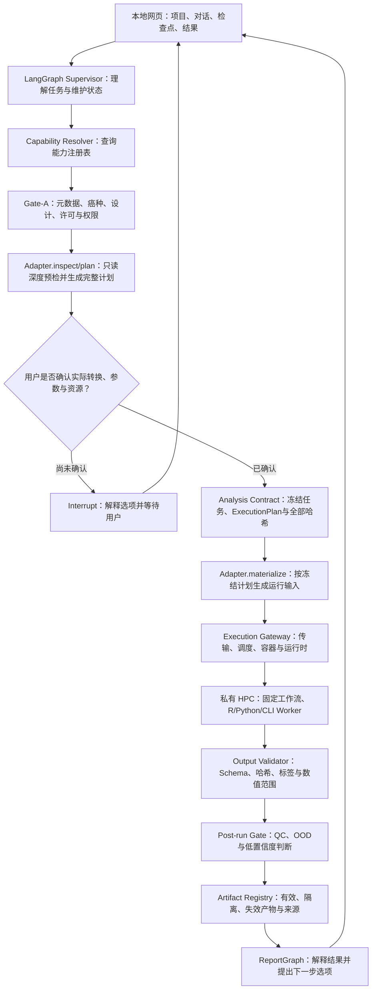

# 首期多组学可交互分析 Agent 设计规范

- 日期：2026-08-20
- 状态：书面设计候选版 v1.0，待用户最终审阅后冻结
- 用途：统一课题范围、老师汇报口径和后续实施计划；冻结后成为设计基线
- 研究边界：研究用途，不接入真实患者诊疗，不构成医疗器械、诊断结论或治疗建议
- 首期称呼：首期多组学 Agent 集成验证原型（Phase-I Integrated Multi-omics Agent Prototype）

## 1. 项目定位

### 1.1 建议课题名称

**面向私有 HPC 的本地优先、可交互、可审计肿瘤多组学分析 Agent——支持 WES、bulk RNA-seq 与单细胞转录组语境化解析**

### 1.2 一句话定义

本项目构建一个安装在研究者电脑上的浏览器式科研工作台：用户以自然语言和结构化表单描述研究问题，Agent 生成可编辑的分析方案，在关键节点暂停并与用户确认，再通过用户自己的 SSH 身份将标准化 WES、bulk RNA-seq 和单细胞下游流程提交到机构 HPC；系统保存输入、参数、决策、版本、日志、模型适用性和证据来源，最终输出研究级报告。

首期“多组学”指在同一控制面中统一管理三类组学能力，并通过版本化产物和候选基因进行可选联动；不包含联合降维、联合预测、多组学机器学习或因果整合模型。

### 1.3 核心问题

现有生信流程通常要求用户掌握命令行、软件依赖、服务器调度、统计设计和结果解释。通用大模型虽然能生成命令或文字，但容易出现参数失配、状态丢失、不可追溯、误用模型和直接执行危险命令等问题。本项目研究如何让 Agent 成为全流程的“可控协调者”，而不是替代确定性生信工具或研究者判断。

## 2. 研究目标与可检验问题

### 2.1 总体目标

建立一个本地优先、数据不默认外发、支持人工中途干预、可在私有 HPC 上恢复执行的肿瘤多组学 Agent 框架，并用 WES、bulk RNA-seq、单细胞下游分析、分型模型和疗效相关模型调用验证其可行性。

### 2.2 研究问题

1. 如何把自然语言研究意图转化为结构化、可验证、可冻结的分析合同？
2. 如何允许用户中途修改 QC、统计设计、聚类、模型等决策，同时防止新旧结果混用？
3. 如何在一个统一框架中正确区分单样本与队列、WES 与转录组、bulk 与单细胞的统计边界？
4. 如何在调用已有分型或疗效相关模型前，自动判断输入单位、预处理、癌种、样本模式和验证范围是否匹配，并在不适用时拒绝输出？
5. 本地优先 Agent 相比手工 SOP、纯命令行或自由对话式 LLM，能否提高非计算用户的任务完成率、可复现性和安全性？

### 2.3 待验证假设

以下均为研究假设，不是既有结论：

- H1：结构化能力契约与人工检查点可降低参数错误和危险提交率。
- H2：不可变分析修订与依赖失效传播可避免中途修改后混用旧结果。
- H3：可执行模型注册表可减少分类器和疗效相关模型的越界调用，并增加合理的 `NOT_EVALUABLE` 或 `ABSTAIN`。
- H4：单细胞语境化可为 bulk RNA 或 WES 候选基因补充肿瘤、免疫或基质细胞中的表达语境；只有匹配数据才能讨论同一研究对象，外部图谱只能形成参考假设，二者均不能仅凭表达证明突变归属或疗效因果关系。

## 3. 用户与典型场景

### 3.1 首期用户

- 生信经验有限的研究生、医生和分子病理研究者；
- 具有合法机构 HPC 账号与研究数据使用权限；
- 进行单样本探索或多样本队列研究；
- 需要中途理解、修改和确认流程，而不是“一键黑盒”。

### 3.2 典型任务

1. 从肿瘤-配对正常 WES FASTQ 获得体细胞小变异并生成研究级解释。
2. 从 bulk RNA-seq FASTQ 获得表达、融合和后续队列统计结果。
3. 从 10x filtered matrix、`.h5ad` 或 Seurat `.rds` 完成常规单细胞下游，并查看 bulk/WES 候选基因在匹配数据或参考图谱的哪些细胞类型中表达。
4. 调用已发表且适用的肿瘤分型模型。
5. 在第二阶段用已有标签和 bulk RNA 表达矩阵训练自定义分型分类器，并将通过审核的模型注册后用于新样本推断。
6. 调用已有疗效相关模型生成研究性预测或评分，不训练自定义疗效模型。
7. 汇总多组学、模型和证据，形成可审计 HTML/PDF、表格和机器可读报告。

## 4. 当前已确认的设计边界

### 4.1 纳入范围

#### WES

- 长期目标：SNV、小 InDel、CNV 及结果解释；
- 首期核心：肿瘤-配对正常样本的体细胞 SNV/小 InDel；
- CNV 为后续里程碑；
- tumor-only 和胚系分析不进入首期。

#### bulk RNA-seq

- 表达定量、样本质控、融合检测；
- 单样本的 QC、表达特征和适配的冻结模型推断；
- 队列首期仅支持一个冻结的独立非配对两组比较模板；检查批次和混杂，但不处理完全混杂、配对、时间序列、多因素或交互设计；
- 剪接分析不进入首期验收。

#### 单细胞 RNA-seq

- 不接收 scRNA FASTQ，不承担比对、UMI 提取和 Cell Ranger/STARsolo 上游；
- 首期输入为 10x `filtered_feature_bc_matrix`、含原始 counts 的 `.h5ad`、含原始 counts 的 Seurat `.rds`，以及能力受限的已处理对象；
- 首期必选能力为对象审计、细胞 QC、过滤、合格输入的双细胞检查、标准化、高变基因、PCA、批次评估、邻接图、Leiden、UMAP、Marker、人工确认注释和单基因/基因集分析；首期不执行批次整合；
- 队列 pseudobulk 是条件开放能力，只在原始 counts、层级元数据、独立生物学重复和冻结统计设计均合格时运行；
- WES/bulk RNA 候选基因的细胞类型和细胞状态语境化是可选组合演示，不是单细胞主路线的完成条件。

#### 模型中心

- 成熟分型模型：直接调用经过复现和注册的现有工具或 R/Python 包；
- 首期成熟模型插件：集成一个 R 包形式的成熟分型分类器，验证完整调用链；
- 首期疗效模型插件：集成一个代码、权重、输入要求和许可均明确的已发表研究模型；
- 自定义分型模型：作为第二阶段能力，仅使用 bulk RNA 表达矩阵和已有分型标签，提供受治理的训练、验证、测试和发布流程；
- 疗效相关模型：只调用已有模型，不提供自定义疗效模型训练；
- 所有输出均为研究用途，不自动形成用药建议。

### 4.2 不纳入首期

- 真实患者诊疗、自动处方或治疗决策；
- 公网多租户 SaaS 处理真实组学数据；
- scRNA FASTQ、raw-droplet cell calling、ambient RNA 完整校正；
- 单细胞 RNA velocity、trajectory/pseudotime、细胞通讯、inferCNV、调控网络、空间组学和多模态；
- 单细胞批次整合、任意统计公式、多时间点/多病灶/多因素交互和混合效应模型；
- 自定义分型训练工厂、大规模模型目录、模型自动投票和运行时安装任意软件包；
- 自定义 WES、多组学或疗效预测模型；
- 让 LLM 生成任意 shell 命令并直接在 HPC 执行；
- 将完整 FASTQ、VCF、表达矩阵、单细胞对象或患者标识默认发送给公共大模型。

## 5. 总体架构

首期采用“本地模块化单体控制端 + 私有 HPC 计算端”，不为每个工具建立独立网络微服务。内部模块边界清晰，但用户看到的是一个连续的项目工作台和一条可对话、可暂停的流程。



### 5.1 控制面与计算面分离

- **LangGraph 是控制面**：理解任务、生成分析规格、检查前置条件、暂停、询问、记录决定、提交和恢复。
- **标准工作流是计算面**：执行版本固定、参数受 Schema 约束的生信程序。
- **HPC 是资源面**：提供计算、存储、调度和机构权限控制。
- **LLM 不持有 SSH 权限**：它只能请求已注册能力，确定性后端再验证并执行。

LangGraph 节点对应“需要保存状态或作出科学决定的边界”，不对应每一条软件命令。例如 WES 对齐、排序和变异检测属于一个冻结工作流内部步骤，而不是三个自由生成的 Agent 节点。

### 5.2 核心调用模式：Registry + Adapter + Executor

| 组件 | 通俗解释 | 责任 | 明确不负责 |
|---|---|---|---|
| Capability Registry | 菜单和说明书 | 记录允许调用的能力、输入、适用范围、版本、资源、许可和输出 | 不执行分析 |
| Capability Resolver | 菜单检索员 | 根据研究问题和现有产物筛选候选能力 | 不修改模型规则 |
| Gate-A | 第一重门禁 | 检查数据类型、癌种、assay、单样本/队列、必需变量、许可和数据出口 | 不读取大矩阵做深度转换 |
| Scientific Adapter | 翻译器/转接头 | 先只读检查矩阵语义、基因覆盖、尺度和参考兼容性，再生成完整计划；确认后才物化输入 | 不绕过输入契约 |
| Execution Gateway | 执行人员 | 负责传输、调度、容器、运行时和状态查询 | 不决定科学方法 |
| Artifact Registry | 结果档案库 | 记录输入、输出、哈希、版本、日志和依赖关系 | 不改写已有产物 |

标准调用链为：

```text
用户请求
→ LangGraph Supervisor
→ Capability Resolver
→ Gate-A 元数据级适用性检查
→ Adapter.inspect/plan 只读深度预检并生成 ExecutionPlan
→ 向用户解释实际转换、候选能力、限制和资源
→ 用户确认
→ Analysis Contract 冻结 ExecutionPlan 及全部版本/哈希
→ Adapter.materialize 生成运行输入
→ Execution Gateway 提交 HPC
→ WAITING_HPC
→ Output Validator 独立验证输出契约
→ Post-run Gate 判断 QC、OOD 和低置信度
→ Artifact Registry 与审计
→ 报告和下一轮对话
```

LLM 只能提出结构化能力请求，例如：

```json
{
  "capability_id": "model.crc.cms",
  "version": "1.0.0",
  "input_artifacts": ["artifact-expression-001"],
  "parameters": {
    "return_probabilities": true
  }
}
```

LLM 不能提交 `Rscript ...`、`bash ...` 或任意远程命令；命令只能由已审核 Adapter 和 Execution Gateway 根据结构化请求生成。Adapter 的计划阶段只读，不修改源产物。

`Analysis Contract` 除研究问题外，必须冻结 `capability_id/version`、manifest/Adapter/wrapper/容器摘要、ModelBundle 与预处理器摘要、参考资源摘要、补齐默认值后的规范化参数、输入 artifact 哈希和 `execution_plan_sha256`。用户确认的是实际将执行的转换与参数，而不是一个抽象工具名称。

三类检查职责不重叠：Gate-A 负责癌种、assay、设计、必需变量、许可和权限；Adapter 深度预检负责矩阵语义、基因覆盖、尺度、重复基因/缺失基因策略和冻结参考兼容性，前两者不满足均为 `NOT_EVALUABLE`；推断后的 OOD、校准范围和低置信度由 Post-run Gate 判定为 `ABSTAIN`。Output Validator 只独立检查 Schema、哈希、标签集合、数值范围和必需产物，不重新判断模型适用人群。

### 5.3 能力注册表

能力注册表首期可使用版本化 YAML/JSON manifest 加 SQLite 索引，不需要引入独立模型注册服务。能力分为：

- `WorkflowCapability`：WES FASTQ、bulk RNA FASTQ、单细胞标准下游等完整工作流；
- `AnalysisCapability`：差异表达、pseudobulk、PCGR 解释等下游分析；
- `ModelCapability`：成熟分型、已有疗效评分和后续批准的自定义分型模型；
- `DataAdapterCapability`：Seurat RDS 到标准单细胞产物等显式转换；
- `ReferenceAsset`：参考基因组、注释、模型权重和知识库快照；它不是可执行动作，只能由 Capability 以唯一版本和哈希依赖。

每个 manifest 至少声明：

- `capability_id`、不可变版本和生命周期状态；
- 科学任务、物种、癌种、研究用途、单样本/队列范围和限制；
- 输入产物类型、基因 ID、数值尺度、方向、元数据、最低特征覆盖和缺失策略；
- 参数 JSON Schema，默认禁止未声明字段；
- Adapter、Driver、入口、容器摘要、软件/R 包/数据库版本；
- CPU、内存、时限和是否需要 GPU；
- 输出 Schema、必需产物、QC 和验证规则；
- 许可、网络访问、数据出口和人工批准要求；
- 论文、代码仓库、commit、参考数据、golden test 和不兼容输入测试。

大型参考包和模型权重不写入 manifest，只登记受控存储位置、版本和 SHA-256。

版本化 YAML/JSON manifest 是只读 source of truth，SQLite 只是可重建索引。启动和提交时均验证 Manifest Schema、哈希、签名/批准状态及其引用的 wrapper、entrypoint、容器和参考资产；这些文件只能来自受信任注册目录，不能来自 LLM、用户请求参数或上传目录。安装、晋级、弃用和退役是独立管理员操作并写入审计事件。普通模式只显示 `APPROVED_FOR_RESEARCH` release；候选版本只在显式开发/复现模式可运行。

模型的科学成熟度与 Capability 的技术 release 分开管理。即使模型权重不变，只要 wrapper、Adapter、包版本、容器或预处理发生变化，就必须发布新的不可变 Capability 版本并重新运行作者示例、golden test、不兼容输入和 OOD 测试。`RETIRED` 版本禁止新调用，但历史运行仍可解析。

### 5.4 Adapter 与 Driver 边界

Scientific Adapter 分为：

- `WorkflowAdapter`：把分析合同翻译为一条固定的 WES、bulk RNA 或单细胞工作流计划；
- `AnalysisAdapter`：调用 PCGR、差异表达、富集或 pseudobulk 等分析；
- `ModelAdapter`：执行模型适用性检查、冻结预处理、推断、校准和拒绝判断；
- `DataAdapter`：显式转换数据对象并生成语义审计报告。

Execution Gateway 内部分为：

- `Transport`：SFTP 和远程路径登记；
- `SchedulerAdapter`：Slurm、PBS 或 local；
- `ContainerRuntime`：Apptainer 或开发环境 Docker；
- `RuntimeExecutor`：Rscript、Python、CLI 或 Workflow；
- 后续可选 `RESTExecutor`：仅在确有院内模型服务时加入。

例如：CMS 分类器是 `ModelAdapter + Rscript RuntimeExecutor`，PCGR 是 `AnalysisAdapter + CLI RuntimeExecutor`，WES 主流程是 `WorkflowAdapter + Workflow RuntimeExecutor`。它们复用同一套 Transport、SchedulerAdapter 和 ContainerRuntime。增加一个模型通常只增加 manifest、wrapper、容器或模型产物及 golden tests，不修改 LangGraph 主图。

### 5.5 R 包与模型的执行契约

R 包不由 FastAPI 进程通过 `rpy2` 直接加载。每个 R 能力使用固定 wrapper：

```text
Rscript --vanilla /opt/capabilities/<capability>/entrypoint.R \
  --request request.json \
  --result result.json
```

wrapper 必须：

1. 读取标准请求并验证输入 Schema；
2. 检查表达单位、矩阵方向、基因映射和缺失字段；
3. 转换为目标 R 包要求的对象；
4. 只调用登记的函数和参数；
5. 输出统一 JSON/TSV、图表、QC、警告和 `sessionInfo()`；
6. 让 stdout/stderr 仅承担诊断，不从控制台文字中解析科学结论。

`request.json` 只允许包含 `artifact_id` 和结构化参数，不接受任意本地/远程路径、entrypoint 或 shell 片段。Execution Gateway 在当前项目沙箱内把 artifact ID 解析成路径，并使用固定 argv 数组启动程序，禁止 `eval` 和字符串 shell 拼接。wrapper、模型、参考和输入只读挂载；结果先写临时目录，通过 Schema 验证后原子重命名并生成 `completed` 标记。运行时禁用用户 R profile、默认网络和动态装包；对外保存的 `sessionInfo()`、stderr 和环境摘要必须脱敏用户名、绝对路径、令牌和环境变量。

模型不是单独一个函数或权重文件，而是不可拆分的 `ModelBundle`：冻结预处理、特征列表、权重/规则、阈值、校准、OOD/拒绝规则、模型卡和运行环境。模型输入不满足契约时返回 `NOT_EVALUABLE`；格式可运行但超出训练分布或置信度不足时返回 `ABSTAIN`。

R 环境以 `renv.lock` 在镜像构建阶段锁定，正式 HPC 作业不运行时联网安装包或执行 `renv::restore()`；Apptainer 镜像用 SHA-256 固定，输入只读挂载，输出仅写当前 `run_attempt` 目录。

### 5.6 主图与子图

`SupervisorGraph` 根据项目和分析合同调用：

- `DataIntakeGraph`
- `WESGraph`
- `BulkRNAGraph`
- `SingleCellAnalysisGraph`
- `ModelHubGraph`
- `EvidenceInterpretationGraph`
- `ReportGraph`
- `HPCMonitorGraph`

子图通过明确的输入输出合同通信，不共享隐式内存对象。

### 5.7 持久化标识

- `project_id`：研究项目；
- `thread_id`：一次持续对话；
- `spec_revision_id`：不可变分析规格修订；
- `run_attempt_id`：一次实际执行；
- `scheduler_job_id`：Slurm/PBS 作业；
- `artifact_id`：文件或结果；
- `model_version_id`：模型版本；
- `evidence_snapshot_id`：证据快照。

这些标识不可混用。一次对话可以产生多个规格修订，一次规格修订可以因故障产生多个执行尝试。

## 6. 人机协同与中途调整

### 6.1 强制检查点

1. 研究问题、数据类型和单样本/队列模式确认；
2. 输入文件、样本配对、参考基因组和元数据确认；
3. 分析计划、参数、资源和预计影响确认；
4. WES/bulk/scRNA QC 异常后的继续、修改或终止；
5. 单细胞过滤阈值、批次评估结果、聚类分辨率和注释确认；
6. 队列设计、比较方向、配对和混杂因素确认；
7. 分型/疗效模型适用性和缺失变量确认；
8. 高成本作业提交、文件覆盖、外部数据传输和最终导出确认。

冻结工作流按这些科学检查点拆成可恢复 stage，而不是一次提交一个无法中断的单体作业。已通过且输入未变化的 stage 可复用；用户修改影响上游输入或参数时，由 `ChangeSet` 精确使受影响的下游 stage 失效。

### 6.2 ChangeSet 与失效传播

用户修改已经确认的输入、参数或方法时：

1. 生成 `ChangeSet`，不原地覆盖旧规格；
2. 创建新的 `spec_revision_id`；
3. 计算受影响的下游节点和产物；
4. 将受影响结果标记为 `STALE`，未受影响结果可复用；
5. 用户确认后仅重跑需要重算的步骤；
6. 报告显示每个结论来自哪个规格和执行尝试。

### 6.3 通用状态

- `PASS`：满足规则；
- `WARN`：可继续但需用户知情；
- `FAIL`：不能继续当前路径；
- `FAIL_OUTPUT_CONTRACT`：程序结束但必需输出缺失、格式错误或未通过结果 Schema；
- `NOT_APPLICABLE`：该项目未选择或不涉及该组学/能力，不表示阴性或失败；
- `NOT_EVALUABLE`：输入不足以完成该分析；
- `ABSTAIN`：模型或解释模块主动拒绝给出结论；
- `WAITING_USER`：等待人工确认；
- `WAITING_HPC`：作业已提交，等待外部状态；
- `STALE`：上游变化导致旧产物失效。

Artifact 另有 `VALID`、`QUARANTINED/INVALID` 和 `STALE` 状态。失败 attempt 的文件元数据、哈希和日志仍进入隔离审计区，但只有通过输出契约的 `VALID + CONSUMABLE` 产物才能成为下游输入。

HPC 作业采用异步轮询或事件恢复，LangGraph 不保持长时间阻塞进程。幂等键为 `hash(spec_revision_id + capability/version/manifest_hash + input artifact hashes + canonical parameters + execution target)`；提交前事务性占用该键，网络恢复时优先绑定已有 scheduler job，不重复执行 `sbatch/qsub`。

## 7. 数据入口与分析合同

### 7.1 数据入口

1. **本地上传**：本地后端验证后，经 SFTP 直接传到用户自己的 HPC 账号；
2. **远程路径登记**：数据已在 HPC 时，只允许登记用户明确授权的只读输入根目录，并验证路径、权限、文件和校验和；
3. **公共数据导入**：仅从已注册来源下载，并记录版本、来源和许可。

浏览器不将大文件先传到公共中转服务器。

### 7.2 分析合同字段

- 研究问题和用途；
- 物种、参考基因组、注释版本；
- 癌种、样本类型和样本关系；
- 单样本/队列模式；
- 输入文件、大小、SHA-256 和存储位置；
- 样本、患者、条件、批次、配对和协变量；
- 工作流、容器、数据库和模型版本；
- 参数、资源、输出和人工确认记录；
- 数据出口、保留和删除策略。

模态专用字段同样属于合同：WES 的 read group、捕获试剂/interval、reference bundle、germline resource、Panel of Normals、污染和 orientation-bias 策略；bulk RNA 的样本身份、独立非配对两组 design/contrast；单细胞的 `subject_id/specimen_id/sample_id/library_id`、矩阵语义、分析模式和允许的统计模板。

合同确认后冻结；执行前重新计算指纹，发生漂移则停止提交并要求新修订。

## 8. 分析子系统

### 8.1 WESGraph

首期主路径：

```text
肿瘤/配对正常 FASTQ
→ 文件、read group、捕获区间和配对检查
→ FastQC/MultiQC
→ 用户确认FASTQ QC
→ BWA-MEM2、排序和Picard重复标记
→ 覆盖度、污染和BAM QC
→ 用户确认BAM QC
→ GATK Mutect2及冻结过滤流程
→ 标准化filtered somatic VCF
→ PCGR固定研究解释插件
→ 研究级证据卡与报告
```

规则：

- 配对关系不清或参考基因组不一致时停止；
- Analysis Contract 必须固定捕获试剂/interval BED、read group、GRCh38 reference bundle、germline resource、Panel of Normals、污染估计和适用的 orientation-bias 处理；必需资源缺失时 `NOT_EVALUABLE`；
- tumor-only 不静默退化为配对流程；
- CNV 作为后续模块独立加入；
- PCGR 是唯一首期解释插件，接收合格 VCF 并执行其固定格式化/注释/报告流程；不接收 FASTQ/BAM，也不能替代上游变异流程。可替换插件只是架构扩展点，不是首期功能。

### 8.2 BulkRNAGraph

```text
FASTQ
→ 完整性与样本表检查
→ fastp与MultiQC
→ 用户确认FASTQ QC
→ STAR比对
→ featureCounts整数counts + RSEM TPM
→ Arriba融合检测
→ 比对后QC与用户复核
→ 单样本结果；或冻结的非配对两组设计检查
→ 条件开放：DESeq2差异表达与fgsea（登记的MSigDB快照）
→ 适用的已注册模型
→ 报告
```

规则：

- 单样本不能做差异表达；
- 队列必须检查生物学重复、样本身份、批次和 condition 是否混杂；首期只接受非配对两组设计，完全混杂或其他设计返回 `NOT_EVALUABLE`；
- 分类器只能接收其规定的表达单位、基因 ID、标准化和样本上下文；
- 融合和表达结论分别保留证据等级；剪接不进入首期验收。

### 8.3 SingleCellAnalysisGraph

#### 输入状态分流

文件扩展名不能单独决定可运行能力。输入契约使用正交字段：

| 字段 | 允许值/含义 |
|---|---|
| `format` | `10x_h5`、`10x_mtx`、`h5ad`、`seurat_rds` |
| `count_state` | `RAW_UMI`、`NORMALIZED_ONLY`、`SCALED_OR_INTEGRATED`、`UNKNOWN` |
| `analysis_state` | `UNPROCESSED`、`PARTIAL`、`PROCESSED` |
| `metadata_state` | `subject_id/specimen_id/sample_id/library_id/condition/batch` 的存在性、唯一性和缺失率 |

AnnData `.raw` 不自动等同于原始 UMI counts；Seurat 的 `data`、`scale.data`、`SCT` 或 `integrated` 也不能当作 counts。Adapter 必须根据矩阵是否非负、近似整数、稀疏性、assay/layer 来源和对象记录进行审计，不能仅凭名称推断。

首期标准 AnnData 产物契约为：

```text
layers["counts"] = 不可变、非负、近似整数的原始 UMI 稀疏矩阵
X = 当前 Scanpy 工作矩阵；导入时复制 counts，归一化后为 log1p 表达
obs = cell_id + subject_id + specimen_id + sample_id + library_id + condition + batch
var = gene_id + gene_symbol + feature_type
obsm["X_umap_imported"] = 可选的原对象 embedding，仅作参考
uns["source_semantics"] = 原 assay/layer、软件版本、sessionInfo 和转换记录
```

DataAdapter 校验细胞/基因顺序、维度、counts 哈希和 metadata 行对齐。首期仅允许经验证的 Seurat RNA assay counts 进入完整重分析；只有 SCT/integrated/normalized 数据时不能伪装成 raw counts。

输入分为两个互斥执行模式：

- `FULL_REANALYSIS`：有合格 `RAW_UMI` counts，进入冻结 Scanpy 标准流程；
- `AUDIT_AND_VIEW`：无合格 counts，只浏览已确认的 embedding/cluster/annotation，并按可确认的数值尺度提供有限基因展示；不能做完整 QC、双细胞、重新聚类或 count-based pseudobulk。矩阵尺度无法确认时，表达比例和 module score 也返回 `NOT_EVALUABLE`。

10x filtered H5/matrix 和符合契约的 `.h5ad` 直接进入 Scanpy；Seurat `.rds` 由低权限、固定版本 R `DataAdapter` 只读解析并显式导出上述标准产物。首期接受 RDS 导入，但标准分析输出只承诺版本化 h5ad，不承诺把 Scanpy 结果无损回写为 RDS。完整 Seurat 分析引擎作为第二阶段能力。

#### 标准流程

```text
输入登记与矩阵语义检查
→ total counts、detected genes与mitochondrial% QC
→ 用户确认样本特异阈值
→ 按 library_id 分别运行固定版本 Scrublet（counts 与捕获批次均可识别时）
→ 过滤
→ Scanpy normalize_total + log1p
→ 固定 flavor 的 highly_variable_genes
→ scale与PCA
→ 批次效应评估
→ 首期不做批次整合；完全混杂时停止组间结论
→ 邻接图、Leiden 聚类、UMAP
→ 用户选择分辨率
→ rank_genes_groups（固定 Wilcoxon）与候选注释
→ 用户确认、修改或保留 Unassigned
→ 目标基因、基因集和描述性细胞组成
→ 单样本描述；满足门禁的队列可做样本级 pseudobulk
→ 版本化对象、图表、表格和报告
```

#### 冻结分析 profile

`profile_id = scrna.scanpy.standard`、`version = 1.0.0`。在 `baseline-freeze` 时必须锁定并写入 manifest：

- Scrublet 版本、按 `library_id` 运行方式、阈值和无法检测时的状态；
- `normalize_total` target sum、`log1p`、HVG flavor/数量、scale、PCA 数量；
- neighbors 参数、Leiden 版本/分辨率候选、UMAP 参数和全部随机种子；
- `rank_genes_groups(method="wilcoxon")` 的过滤和排序规则；
- `scanpy.tl.score_genes` 或替代的唯一登记方法、背景基因和基因映射策略；
- pseudobulk 聚合规则与固定 DESeq2 公式：独立两组 `~ condition`，简单配对 `~ subject_id + condition`；每个 cell type 的最小样本数、最小细胞数、设计矩阵和自由度门槛；
- 候选注释使用的版本化 marker 资源、证据字段和 `Unassigned` 规则。

LLM 只能解释登记的 marker 证据、指出冲突并请求用户确认，不能作为不可审计的最终细胞注释算法。

#### 统计边界

- `subject_id` 表示患者/供者，`specimen_id` 表示具体组织、病灶和时间点标本，`sample_id` 表示用于统计的生物学样本，`library_id` 表示一次 10x 捕获/建库；四者不能混用；
- 双细胞检测按 `library_id` 分开运行；pseudobulk 按 `sample_id × cell_type` 聚合；`subject_id` 只作为简单配对的阻断变量，不能把同一受试者不同时间点或病灶直接相加；
- 细胞嵌套在生物学样本和受试者内；组间推断不能把细胞当作独立重复，单样本只做描述；
- 首期只冻结两种队列设计：独立非配对两组，以及同一受试者两条件的简单配对；多时间点、多病灶、多因素交互、任意公式和混合效应模型返回 `NOT_EVALUABLE`；
- 每个 cell type 分别检查最小生物学重复、最小细胞数、设计矩阵满秩和剩余自由度；不合格的 cell type 单独拒绝，不能用其他 cell type 的细胞数补足；
- 没有合格 `subject_id/sample_id/library_id` 或原始 counts 时，相应统计或双细胞能力返回 `NOT_EVALUABLE`/`WARN`；
- 不在 integrated/scaled matrix 上做正式 count-based DE；
- batch 与 condition 完全混杂时不得声称批次已校正；
- cluster marker ranking 可在细胞层面用于探索和辅助注释；condition-specific DE 必须采用样本级 pseudobulk。两者使用不同标题、证据等级和结果 Schema；
- UMAP 距离和簇形状不是独立统计证据；
- 零表达表述为“未检测到”，不等同于生物学不表达；
- 3′ scRNA 中某基因表达不证明该细胞携带 WES 突变或融合。
- 首期细胞组成仅报告每个样本的描述性比例和可视化，不进行正式 differential abundance；module score 或其他组间推断仍须遵守受试者/样本层面的重复、配对和协变量门禁。

#### 跨组学功能

- bulk DEG 在不同细胞类型中的表达、检测比例和满足设计条件时的患者/样本级差异；
- bulk 分型或疗效 signature 在单细胞中的结果只能命名为“signature expression contextualization”，记录评分算法、基因映射覆盖率和缺失策略；它不等价于原 bulk 模型推断，不能称为单细胞分型或单细胞疗效预测；
- WES 突变基因的细胞类型表达语境；
- 跨组学关系分为 `EXACT_SPECIMEN_MATCH`（同一 specimen/时间点且 aliquot 关系明确）、`SUBJECT_RELATED`（同一受试者但不同标本）和 `EXTERNAL_REFERENCE`（非匹配或公共数据）；只有第一类可称匹配多组学语境，第二类只能报告个体相关观察，第三类只能形成参考假设；
- 首期不提供在线图谱查询；外部参照只能是用户提供或已登记且版本化的 `ReferenceAsset`；
- bulk 免疫信号可结合细胞类型表达形成关于免疫浸润或肿瘤细胞内在表达的探索性假设，不能自动判定来源；
- 不把只在 bulk 上验证的分类器直接当作单细胞分类器。

三条黄金路线独立验收，跨组学语境化另设可选组合演示：`已完成 bulk/WES artifact + 已完成 scRNA artifact → 候选基因映射 → 匹配等级声明 → 语境化报告`。没有 bulk/WES 产物时不影响单细胞路线完成。

## 9. Model Hub

首期 Model Hub 的目标是验证一个成熟分型模型和一个已发表疗效相关研究模型，而不是建立大而全的模型市场。模型首先按科学适用性、代码/权重、许可、预处理和复现结果选择，最终 runtime 由获选 ModelBundle 决定，不能为了展示 Rscript 或 CLI 而选择科学上较差的模型。Rscript wrapper 作为独立工程契约测试，PCGR 已覆盖 CLI 插件形态；PCGR 不算分类器。

### 9.1 用户可见的两类分型

#### 成熟分型

直接调用已发表、可复现、许可允许且输入匹配的模型。下列是文献复现候选，不等于首期已经承诺集成：

- 泛癌免疫分型：ImmuneSubtypeClassifier；
- 结直肠癌：优先 true single-sample 的 CMS-SSP，明确区分队列依赖的 CMS-RF；
- 乳腺癌：PAM50 的研究用途开放实现，明确其中心化和队列依赖，不使用商业 Prosigna 作为替代实现。

#### 自定义分型

该能力放在第二阶段。输入仅限 bulk RNA 表达矩阵和既有类别标签，训练能力与日常推断能力严格分开：

```text
标签/样本/数据质量检查
→ 按患者及机构划分 Train/Validation/Test
→ 所有预处理和特征选择限定在训练折内
→ 候选模型比较（如逻辑回归、Random Forest、XGBoost）
→ 嵌套交叉验证
→ 概率校准、类别不平衡和不确定性评估
→ 独立测试或外部验证
→ 输出冻结预处理、特征、权重、阈值、验证报告和模型卡
→ 人工审核
→ 注册为新的 ModelCapability
→ 以后通过普通 ModelAdapter 对新样本推断
```

新样本输入契约不匹配时返回 `NOT_EVALUABLE`；输入契约满足但 OOD 或低置信度时返回 `ABSTAIN`。

### 9.2 疗效相关模型

只调用已有模型，不训练自定义疗效模型。首批文献复现候选按照用途分层，最终首期只选择一个通过完整审计的模型：

- RNA 免疫治疗研究模型：COMPASS 作为主要复现候选；
- TIDE、EaSIeR 作为辅助评分，不能用简单多数投票制造“共识”；
- LORIS 只有在 TMB 和规定临床变量齐全时才可评估；
- oncoPredict 单列为“研究性药物敏感性假设”，不称为患者疗效预测；
- 系统综述或 benchmark 论文不被错误包装为可调用模型。

### 9.3 模型生命周期

```text
DISCOVERY_ONLY
→ REPRODUCED
→ CANDIDATE
→ INTERNALLY_VALIDATED
→ EXTERNALLY_VALIDATED
→ APPROVED_FOR_RESEARCH
→ DEPRECATED
→ RETIRED
```

只有达到项目设定门槛并经人工批准的版本才出现在默认模型列表。

### 9.4 模型注册字段

- 任务、癌种、适用人群和研究用途；
- 单样本/队列要求；
- assay、平台、基因 ID、表达单位、标准化和中心化；
- `model_artifact_id/version/sha256`、`preprocessor_id/version/sha256` 及有序转换步骤；
- 特征列表及哈希、重复基因聚合、缺失基因策略、最低覆盖率；
- 是否依赖队列中心化或冻结参考队列，并固定 reference artifact 哈希；
- class labels、reference level、阈值、校准器版本、OOD 指标/阈值和可枚举 abstain reason codes；
- 训练与外部验证队列；
- 输出语义、概率校准、已知局限；
- Adapter、wrapper、容器、软件、R/Python 包和数据库版本/哈希；
- 疗效相关模型额外声明治疗类别、治疗线次/场景、预测终点、时间窗、cutoff 和必需临床协变量；
- 许可、商业与临床使用限制；
- 模型卡和复现证据。

### 9.5 规范调用示例

以下是 Schema 结构示例，不代表已选择的首期模型。

```yaml
api_version: multiomics-agent/v1
kind: ModelCapability
identity:
  capability_id: model.example.subtype
  version: 1.0.0
  lifecycle: APPROVED_FOR_RESEARCH
scientific_scope:
  modality: bulk_rna
  cancer_types: [example_cancer]
  inference_scope: single_sample
  intended_use: research_only
input_contract:
  artifact_type: gene_expression_matrix
  gene_id_type: declared_by_model
  value_scale: declared_by_model
  minimum_feature_coverage: declared_by_model
implementation:
  adapter_id: model_adapter.r_package
  runtime: rscript
  entrypoint: trusted://model.example.subtype/entrypoint.R
  container_sha256: sha256:registered_digest
model:
  model_artifact_sha256: sha256:registered_model
  preprocessor_sha256: sha256:registered_preprocessor
output_contract:
  schema: model_result/v1
governance:
  network_access: denied
  approval_required: true
```

LLM 产生的 `InvocationRequest`：

```json
{
  "capability_id": "model.example.subtype",
  "version": "1.0.0",
  "input_artifacts": ["artifact-expression-001"],
  "parameters": {"return_probabilities": true}
}
```

只读 Adapter 预检后生成、供用户确认并冻结的 `ExecutionPlan` 摘要：

```json
{
  "adapter_version": "1.0.0",
  "input_checks": {"gene_mapping": "PASS", "feature_coverage": 0.97},
  "transformations": ["registered_gene_mapping", "frozen_preprocessor"],
  "runtime": {"type": "rscript", "container_sha256": "sha256:registered_digest"},
  "resources": {"cpu": 2, "memory_gb": 8},
  "execution_plan_sha256": "sha256:plan_digest"
}
```

wrapper 返回的 `ModelResult`：

```json
{
  "status": "PASS",
  "prediction": {"label": "example_class", "probabilities": {}},
  "applicability": {"status": "PASS", "reason_codes": []},
  "provenance": {
    "capability_version": "1.0.0",
    "model_sha256": "sha256:registered_model",
    "preprocessor_sha256": "sha256:registered_preprocessor"
  }
}
```

输入契约不满足时不产生 prediction，返回 `NOT_EVALUABLE`；推断可执行但 OOD 或置信度不足时返回 `ABSTAIN` 和稳定 reason code。

## 10. 解释与报告

首期解释范围仅为：结构化呈现固定版本 PCGR 输出、模型卡、流程 QC 和已登记数据库/证据快照。首期不自动实时搜索、更新或综合多部临床指南，也不把“研究级解释”表述成临床报告。

### 10.1 证据卡

每条解释包含：

- 观察结果；
- 数据与分析版本；
- 证据来源、版本和查询日期；
- 支持、冲突和缺失证据；
- 适用癌种和研究边界；
- 置信状态：`PASS/WARN/NOT_EVALUABLE/ABSTAIN`；
- 需要人工复核的事项。

### 10.2 报告结构

报告由已经运行且适用的 Capability 条件组装；未运行的组学或模型不生成结果章节，项目总览只标记 `NOT_APPLICABLE`，不能留下看似阴性的空白结论。

1. 项目与研究问题；
2. 数据、参考版本和分析范围；
3. QC 与可评估性；
4. WES 结果；
5. bulk RNA 结果；
6. 单细胞聚类、注释与候选基因语境；
7. 分型模型；
8. 疗效相关模型；
9. 多组学联合观察；
10. 局限性、冲突、拒绝输出和待验证问题；
11. 方法、软件、容器、参数和审计记录。

输出：HTML/PDF、XLSX/TSV、JSON/YAML 和可归档运行包。

## 11. 本地网页与用户体验

### 11.1 页面布局

- 左侧：项目、数据、样本、历史运行和产物树；
- 中间：流程、当前步骤和结果 Viewer，可切换 QC、WES、bulk RNA、单细胞、模型和报告；
- 右侧：Agent 对话与人工决策，说明为何暂停、需要确认什么、修改会使哪些结果失效；
- 顶部：项目、模式、HPC 连接、作业状态和告警；
- 独立页：任务中心、Model Hub、证据报告、服务器和参考资源设置。

### 11.2 部署路线

#### 第一阶段：单用户 localhost

- 前后端安装在研究者电脑；
- 浏览器访问 `127.0.0.1` 的随机端口；
- SQLite 保存本地项目状态；
- 每位用户用自己的 SSH 身份连接 HPC；
- 不暴露公网服务。

#### 第二阶段：院内多用户

- 部署于机构内网或 VPN；
- 使用 HTTPS、院内 SSO/OIDC、MFA、RBAC、项目隔离、配额和集中审计；
- 每个用户仍映射到个人或受控服务身份；
- 状态存储升级为 PostgreSQL。

#### 多中心推广

每家机构独立部署相同控制端，原始数据留在本机构。公共网站只提供介绍、文档、安装包和公共数据演示，不处理真实敏感数据。

## 12. 安全与隐私设计

### 12.1 本地服务

- 默认仅绑定 `127.0.0.1`，禁止默认 `0.0.0.0`；
- 每次启动生成随机会话凭据；
- 严格校验 Host、Origin，CORS 不使用通配符；
- 状态修改使用 CSRF 防护；
- 前端资源本地打包，默认不加载 CDN、广告、统计和崩溃遥测；
- 使用 CSP 限制脚本和外部连接。

### 12.2 SSH 与凭据

- 优先使用系统 `ssh-agent`、机构统一认证或 OS 凭据库；
- 密码、私钥和 API key 不写入浏览器 localStorage、聊天、项目数据库或日志；
- 严格校验 `known_hosts` 和服务器指纹；
- 用户使用自己的最小权限 HPC 账号；
- 项目目录权限 700，敏感文件权限 600；
- 支持凭据撤销和轮换。

### 12.3 上传与文件解析

- 白名单输入类型，校验扩展名、签名、内部结构、大小和配额；
- 上传前后计算 SHA-256；
- 文件使用系统生成标识存储在 Web 根目录之外；
- `.h5ad/.rds` 在低权限 Worker 或隔离作业中解析，不由 Web 主进程直接反序列化；
- 首期不接受任意压缩包；
- 路径规范化并拒绝路径穿越和符号链接越界；已存在的远程输入可以位于用户授权的只读白名单根目录，所有输出、临时文件和可写路径必须位于当前项目沙箱；
- 暂存文件有保留期限和显式删除功能。

### 12.4 Agent 执行边界

- 仅调用已注册工作流和结构化参数；
- 禁止自由 shell 直接执行；
- 上传、提交高成本任务、覆盖、导出和外部传输必须确认；
- 运行目录不可变，新修订新建目录；
- 所有外部操作有用户、时间、规格、作业和结果审计。

### 12.5 大模型数据出口

- 首次进入项目、输入任何研究内容前，必须选择“本地/院内部署模型”“公共云模型”或“无 LLM 表单模式”；公共云模式先显示供应商、拟发送字段和保留说明；
- 默认不向公共模型发送原始或逐样本敏感数据；
- 无 LLM 模式通过结构化表单完成配置，并可运行全部确定性分析；
- 云模型只接收最小化、脱敏后的结构化摘要；
- 外发前展示接收方、字段、用途和保留说明；
- 用户明确确认后才发送，并记录审计；
- 后续可支持院内部署模型。

对外表述为“本地优先、默认关闭外发并可审计”，不宣称绝对安全或基因组数据已经完全匿名。真实患者数据接入前必须经过机构伦理、信息安全、数据治理和独立安全测试。

## 13. 错误处理与恢复

| 错误类型 | 默认行为 |
|---|---|
| 输入缺失或 Schema 不合法 | `FAIL`，指出缺失字段，不提交作业 |
| 前置状态缺失 | `NOT_EVALUABLE` 或建议明确的补充步骤 |
| QC 异常 | `WAITING_USER`，展示影响和选项 |
| 软件/数据库不可用 | `FAIL`，保留诊断，不盲目重试 |
| SSH/网络中断 | 保留状态，有限重试，使用幂等键防止重复提交 |
| HPC 作业失败 | 分类失败原因，只重试失败步骤或新建 attempt |
| 模型输入类型、单位、癌种或必需特征不匹配 | `NOT_EVALUABLE`，不执行推断 |
| 模型可以执行但 OOD 或低置信度 | `ABSTAIN`，不强制给出类别 |
| 输出文件缺失或 Schema 不合法 | `FAIL_OUTPUT_CONTRACT`，文件登记到隔离审计区但不得成为下游输入 |
| 上游参数改变 | 下游标记 `STALE`，生成新修订 |
| 报告证据冲突 | 同时显示冲突来源，不由 LLM 静默裁决 |

所有失败都保留 stdout/stderr 的受限摘要、完整服务器日志位置、软件版本、参数和恢复建议；日志必须脱敏并限制大小。

只有网络中断、调度器瞬时错误等基础设施故障允许有限自动重试；科学适用性失败时不得自动换模型、改变工作流或放宽阈值。

## 14. 工作流与工具适配策略

- **bulk RNA**：保留并版本化仓库现有远程执行核心和 workflow profile，固定为 fastp/MultiQC → STAR → featureCounts + RSEM → Arriba；首期不迁移到另一套 RNA 工作流；
- **WES**：使用固定 release 的 nf-core/sarek 作为 `WorkflowRuntime`，只开放 GRCh38 肿瘤-正常 Mutect2 小变异路径；实际 release、容器和参考 bundle 在 baseline-freeze 里程碑锁定；
- **单细胞**：使用项目维护的固定 Scanpy Worker；RDS 仅由独立 R DataAdapter 导出标准 AnnData；
- **PCGR**：使用官方固定容器和参考包作为唯一首期解释实现；
- 上述异构实现统一经 `WorkflowAdapter/AnalysisAdapter → Execution Gateway` 调用，接口可扩展不表示首期允许用户切换工具链；
- 首期只对目标 HPC 实际使用的一个调度器做端到端真实站点验收；其他已有 Slurm/PBS/local `SchedulerAdapter` 仅保留接口、单元测试和模拟测试，不宣称已通过第二个真实站点验证；
- HPC 优先使用 Apptainer/Singularity，开发和本机环境可使用 Docker；
- 每个适配器声明输入、前置条件、参数 Schema、资源、输出、版本、风险和副作用；
- R 依赖在构建阶段由 `renv.lock` 固定，Python/CLI 依赖同样写入锁文件或镜像；正式任务不联网安装包；
- 输入目录只读，输出、临时文件和日志只写当前项目及 `run_attempt`；
- 科学结果必须由声明的 JSON/TSV/Parquet/VCF/h5ad 等输出契约读取，不能从 stdout 文本猜测；
- 工作流升级必须新建版本并通过回归验证，不直接替换已有可复现版本。

## 15. 首期范围与研发阶段

首期不是普通意义上的单功能 MVP，而是“首期多组学 Agent 集成验证原型”。最终演示同时包含三条最小纵向黄金路线，但每种组学只支持一个固定输入范围、一个冻结工作流和一套明确产物，不提供任意工具菜单。

首期验证的核心不是工具数量，而是：统一编排、人工检查点、HPC 异步执行、插件调用、结果版本化、适用性拒绝和全流程追溯。

### 15.1 已有基础

- bulk RNA FASTQ 验证与现有固定分析 profile；
- SSH/SFTP、服务器预检；
- Slurm/PBS/local 提交和状态轮询；
- 上传、下载、报告、运行隔离、分析合同和审计基础。

这些能力发展为共同的 `Execution Gateway`、`Analysis Contract` 和 `Artifact Registry`，不重复重写。

### 15.2 首期统一能力清单

`capability_id` 保持稳定，版本单独使用语义化版本号。首期架构冻结以下五类能力槽：

| Capability ID | 首期 release | 范围 |
|---|---:|---|
| `workflow.bulk_rna.grch38_pe_expression_fusion` | `1.0.0` | 固定 paired-end bulk RNA 表达/融合主线 |
| `workflow.wes.grch38_paired_somatic_small_variant` | `1.0.0` | 固定肿瘤-正常 SNV/small InDel 主线 |
| `analysis.scrna.scanpy_standard` | `1.0.0` | 有合格 counts 的标准 Scanpy 下游 |
| `data_adapter.seurat_rds_to_anndata` | `1.0.0` | RDS 语义审计与标准 AnnData 导出 |
| `interpretation.pcgr.somatic` | `1.0.0` | 合格 somatic VCF 的研究级解释 |

另设模型槽 M1（成熟分型）和 M2（已有疗效研究模型）。进入各自开发计划前必须冻结具体模型名称、`capability_id/version`、癌种、许可、输入尺度、ModelBundle、作者示例数据和独立验证队列；审计不通过时停止该槽，不能在开发中临时换成另一个模型。HBR/UHR 等 bulk 工程基准不能替代癌症模型验证数据。

所有能力均通过同一条链路调用：

```text
Registry → Gate-A → Adapter.inspect/plan → 用户确认 → Analysis Contract
→ Adapter.materialize → Execution Gateway → HPC → Output Validator
→ Post-run Gate → Artifact Registry
```

### 15.3 黄金路线 A：bulk RNA-seq FASTQ 到研究级结果

首期约束：人类、GRCh38、Illumina paired-end FASTQ；支持单样本表达/融合，以及一个冻结的独立非配对两组比较模板。

```text
FASTQ与样本表检查
→ fastp与MultiQC
→ 用户确认FASTQ QC
→ STAR比对
→ featureCounts整数counts与RSEM TPM
→ Arriba融合检测
→ 比对后QC人工检查点
→ counts/TPM与融合表
→ 条件开放：DESeq2两组差异表达与fgsea（登记的MSigDB快照）
→ 适用性门禁
→ 已注册分型或疗效模型
→ 版本化报告
```

首期不支持任意统计公式、配对、时间序列、多因素或交互设计；完全混杂时返回 `NOT_EVALUABLE`。剪接不进入首期验收，单样本不进行差异表达。

### 15.4 黄金路线 B：配对 WES FASTQ 到体细胞小变异

首期约束：人类、GRCh38、肿瘤-配对正常、一个 caller、SNV 和 small InDel。

```text
肿瘤/正常配对和FASTQ检查
→ FastQC/MultiQC与用户检查点
→ BWA-MEM2比对
→ 排序、Picard重复标记、覆盖度/污染/BAM QC
→ 用户确认BAM QC
→ GATK Mutect2及冻结过滤流程
→ 标准化filtered somatic VCF
→ PCGR固定格式化、注释与研究级解释
→ 版本化报告
```

Analysis Contract 同时冻结捕获区间、read group、GRCh38 reference bundle、germline resource、Panel of Normals、污染和 orientation-bias 处理策略。首期不包含 CNV、SV、tumor-only、胚系分析、多 caller 共识、全面 MSI/生物标志物或临床级变异报告。PCGR 只接收合格下游产物，不代替 FASTQ 到 VCF 的上游流程。

### 15.5 黄金路线 C：已定量单细胞对象到标准下游

主验收输入为 10x filtered feature-barcode H5/matrix 或含合格 raw UMI counts 的 h5ad；Seurat RDS 只单独验收“正确导出 counts/metadata 并进入同一引擎”，不建立第二套生物学结果基线。不接收 scRNA FASTQ 和 raw-droplet matrix。

```text
对象和counts语义审计
→ 每样本QC
→ Agent建议阈值并由用户确认
→ 按library运行固定版本Scrublet
→ Scanpy normalize_total/log1p、固定HVG、scale和PCA
→ 批次评估；首期不做整合
→ 邻接图、Leiden和UMAP
→ 用户确认聚类分辨率
→ 固定Wilcoxon Marker和候选注释
→ 用户确认/修改/保留Unassigned
→ 目标基因、基因集和描述性细胞组成
→ 条件扩展：有独立样本且元数据和设计合格时执行pseudobulk
→ 版本化h5ad、图表和报告
```

Seurat RDS 只由隔离 R Adapter 做显式、可审计的标准化导出；首期标准分析产物为版本化 h5ad，不承诺回写 RDS。统计推断以受试者/生物学样本为重复，不能以细胞数量代替样本量。pseudobulk 是满足门禁后的条件验收，不是所有单细胞输入的必需产物；bulk/WES 候选基因语境化属于独立的可选组合演示 D。

### 15.6 首期模型插件

首期验证三个科学插件类别：

1. 一个成熟肿瘤分型分类器；
2. 一个已发表疗效相关研究模型；
3. PCGR 解释插件，归入 `AnalysisCapability`，不算分类器。

选择标准为：算法或权重可获得、许可允许集成、预处理可复现、有作者示例数据、输入要求可机器校验，并能定义 `NOT_EVALUABLE`/`ABSTAIN`。runtime 是选择后的实现属性，不是科学模型筛选条件。疗效模型只输出已发表模型定义的研究分数或分层，不输出治疗建议。

### 15.7 必需产物

| 能力 | `VALID + CONSUMABLE` 的最低必需产物 |
|---|---|
| bulk RNA | 输入/样本 manifest、FASTQ与比对QC JSON、gene counts、TPM、fusion TSV、输出 manifest；条件队列另含 design/contrast 与 DE/富集表 |
| 配对 WES | 配对/reference manifest、FASTQ QC、BAM/覆盖度/污染 QC、filtered somatic VCF及索引、PCGR报告、输出 manifest |
| 单细胞 | 输入语义审计、cell/sample QC、过滤记录、版本化 h5ad、cluster/annotation/marker 表和固定图集；条件队列另含 pseudobulk/design/contrast |
| RDS DataAdapter | 源对象审计、assay/layer选择、counts哈希、cell/gene顺序与metadata对齐检查、标准h5ad和转换记录 |
| 模型 | applicability report、ModelResult JSON、模型卡、session/runtime记录和输出 manifest |

任一必需产物缺失、Schema 不合法或哈希不匹配均触发 `FAIL_OUTPUT_CONTRACT`；失败文件保留在隔离审计区，不得作为下游输入。

### 15.8 研发顺序

1. **围绕现有 bulk RNA 建立最薄闭环**：本地网页、一个 LangGraph 主线、Analysis Contract、一个 QC 检查点、现有 HPC 执行和版本化产物；
2. **从已跑通闭环抽象共同组件**：Registry、Gate、Adapter、Execution Gateway、Artifact Registry、ChangeSet 和数据出口控制；
3. **单细胞接入**：Scanpy 黄金路线和隔离 RDS DataAdapter；
4. **配对 WES 接入**：固定 nf-core/sarek 小变异路径和 PCGR；
5. **模型选择门与两个插件**：先完成证据/许可/复现冻结，再接成熟分型和已有疗效研究模型；
6. **统一报告、组合演示 D 与公开基准验收**。

这是工程顺序，不是删减最终首期范围。每一阶段设置验收门，前一阶段未通过时不通过堆叠更多工具推进。

### 15.9 第二阶段扩展

- 受治理的自定义 bulk RNA 分型训练工厂；
- WES CNV/SV、更多生物标志物和其他明确验证的工作流；
- bulk RNA 复杂实验设计和剪接分析；
- 单细胞批次整合、正式 differential abundance、完整 Seurat 分析能力、任意/多因素/纵向统计设计及更多高级模块；
- 更多经复现的分型和疗效相关模型；
- 院内多用户部署和跨站点适配。

## 16. 评价方案

### 16.0 首轮候选基准与判定原则

首轮工程评价使用以下公开或仓库内已登记数据：

- bulk RNA：仓库已有的 Griffith HBR/UHR ERCC 3×3 与 nf-core GSE110004 3×3 基准配置；
- 单细胞单样本：10x PBMC3k，用于输入、QC、聚类、Marker 和已知细胞标记语境；
- 单细胞队列：Kang IFN-β 多供者 PBMC 数据，用于患者/供者级 pseudobulk 和配对设计；
- WES：HCC1395/HCC1395BL 肿瘤-正常参考样本及公开 somatic truth set；
- 模型：每个候选模型的原作者示例数据，加一个许可允许的独立公开队列。

WES `baseline-freeze` 必须进一步登记具体 FASTQ accession、捕获试剂与 capture BED、truth VCF release、confident region、参考 bundle 和全部 SHA-256；任一资产变化均生成新的 benchmark release，不能横向混算 precision/recall。

比较对象为：锁定版本的参考脚本直接运行、通过 Agent 调用同一能力，以及用户研究中的手工 SSH + SOP。正式开发前设置独立的 `baseline-freeze` 里程碑：先运行一次参考实现，冻结软件/容器/参考包、随机种子、输入/输出 Schema、每项数值容差和科学性能门槛，再允许实现代码进入验收。设计文档不把未经校准的相关系数写成正式门槛。

验收分为两层，不能互相替代：

1. **工程等价性**：Agent 与锁定参考实现具有相同输入、样本顺序、参数、contrast、必需产物和确定性数值/集合容差；
2. **科学基准**：WES 独立对 truth set 报告 precision/recall/F1，bulk 检查样本身份、基因映射和比较方向，单细胞检查 library/sample 聚合与设计矩阵，模型复现作者参考结果及其不适用输入行为。

数据合同、校验和、同一用户跨项目隔离、预设失效传播和所有阻断安全测试必须 100% 通过；故障注入不得产生重复 HPC 作业，默认模式不得观测到原始数据外发。任一跨项目读取、敏感凭据落盘、新旧结果混用或未注册命令执行均为阻断失败，不能由平均分抵消。

### 16.1 生信结果

- 与固定参考工作流比较样本顺序、参数、必需产物及冻结数值/集合容差；
- WES 除工程等价性外，使用公开 truth set 独立评估 precision、recall、F1；
- bulk RNA 检查样本身份、基因 ID 映射、矩阵方向、counts/TPM、融合候选和 DE contrast 方向，不能只看相关系数；
- 单细胞比较 QC 保留、聚类、library/sample 层级、pseudobulk 聚合、design matrix 和 contrast；注释只验收 marker 证据、候选标签、人工修改和最终标签均可追溯，PBMC3k 已知 marker 只作 sanity check，不把人工注释一致率声称为算法准确率；
- RDS Adapter 必须验证 counts 逐元素/哈希一致、cell/gene 顺序、metadata 对齐，并拒绝把 SCT/integrated/data layer、损坏对象、非 Seurat RDS 或未知语义误判成 raw counts；导入 embedding 使用 `*_imported` 命名，不与新结果混用；
- 所有比较记录版本和容器摘要。

### 16.2 模型

- 复现原作者示例或公开队列结果；
- 检查单样本/队列依赖、输入单位、基因覆盖、类别平衡和校准；
- 记录内部/外部验证、置信区间和 OOD/ABSTAIN 行为；
- 分类模型分别验证标签一致和概率数值容差；连续疗效评分验证绝对/相对数值容差，不能使用“分类一致率”；
- 输入不兼容必须 `NOT_EVALUABLE`；只有模型可执行但 OOD 或低置信度时才 `ABSTAIN`；
- 第二阶段自定义分类器使用患者或机构级拆分，避免信息泄漏。

### 16.3 Agent 与恢复

- 任务完成率和危险操作阻止率；
- 中途修改后失效传播正确率；
- 重启、网络中断、调度器失败和重复回调的恢复率；
- 是否出现重复作业、跨项目读取或新旧结果混用；
- 报告中输入、参数、版本、证据和产物的可追溯完整度。

### 16.4 用户研究

- 首轮采用 12 名目标用户的探索性、顺序平衡交叉试验，每人完成 4 个小型数据、预计算检查点或调度器模拟任务，比较本地 Agent 与标准化 SSH + SOP；两组提供等量培训，该样本量只用于可用性先导；
- 完整 WES/RNA/scRNA 生信正确性由自动基准单独评价，避免 HPC 等待和教学效应替代界面效应；
- 记录任务完成时间、成功率、求助次数、参数错误和危险操作；首期原型进入下一阶段的候选门槛为 Agent 条件下总体任务完成率不低于 80%、零关键危险执行，且错误数不高于手工 SOP 条件；
- 记录新手对参数解释、暂停原因、结果边界和信任的理解；
- 不以主观满意度替代生信正确性。

### 16.5 安全测试

- 确认仅监听 loopback；
- 未授权 Origin、CSRF、路径穿越、符号链接越界和恶意文件测试；
- 凭据、患者标识和原始数据的日志泄漏扫描；
- 上传前后校验和一致性；
- 公共模型数据出口审计；
- 首期验证同一用户不同项目之间的隔离；院内多用户阶段再验证 RBAC、身份和跨用户隔离。

## 17. 预期创新点

拟重点验证两项主要研究贡献：

1. **可恢复的人机协同与依赖失效传播**：以 LangGraph 管理真实 HPC 长作业、人工暂停、恢复和 `ChangeSet`；用户中途修改不会污染旧结果，每个结论可回溯到具体规格修订。
2. **可执行 Capability/Model Contract 与适用性拒绝**：把输入语义、预处理、适用癌种、单样本/队列要求、许可、版本、OOD 和拒绝规则变成运行前后可执行约束，而不是只写在说明书中。

以下作为工程与验证场景，不单独夸大为八个创新点：控制面-计算面分离、本地优先数据出口、三类组学统一编排、模型插件、以及 bulk/WES 候选基因的单细胞语境化。第二阶段自定义分型训练工厂用于验证该契约能否管理“训练产物→人工审核→注册→新样本推断”的完整生命周期。

这些是拟验证的系统与方法学贡献，不能在未完成对照实验前写成已经证实的优势。

## 18. 主要风险与缓解

| 风险 | 缓解措施 |
|---|---|
| 范围过大，沦为平台堆砌 | 分阶段实现；论文聚焦控制、适用性和可追溯性，不以工具数量为创新 |
| 单细胞输入语义混乱 | 强制检查 counts/layer/assay、元数据和分析状态；能力降级 |
| 将细胞当独立样本 | 受试者/生物学样本级统计合同和 pseudobulk 门禁 |
| 批次校正删除真实差异 | 先评估、后人工确认；混杂时拒绝结论 |
| 分类器跨平台误用 | 模型注册表、输入契约、OOD 和 ABSTAIN |
| 疗效模型被误解为治疗建议 | 分层命名、研究用途声明、证据和限制并列展示 |
| LLM 幻觉或危险命令 | 结构化能力、禁止自由 shell、确定性验证和人工确认 |
| 本地网页被误认为绝对安全 | loopback、令牌、CORS/CSRF/CSP、文件隔离和独立安全测试 |
| 多中心环境差异 | 容器、参考包清单、站点适配器和逐站点验收 |
| 软件和知识库更新导致漂移 | 固定版本、证据快照、回归测试和模型生命周期管理 |

## 19. 向老师汇报的最终口径

> 本课题拟构建一个面向私有 HPC 的本地优先、可交互、可审计多组学研究分析 Agent。首期在一个统一 LangGraph 控制面上独立跑通三条固定黄金路线：bulk RNA-seq FASTQ 到表达/融合，肿瘤-配对正常 WES FASTQ 到体细胞 SNV/小 InDel 与 PCGR 研究级解释，以及从 10x filtered H5/matrix、h5ad 或 Seurat RDS 开始的单细胞标准下游；三条路线通过后，再可选演示 bulk/WES 候选基因的单细胞语境化。Agent 不直接运行任意生信命令，而是通过 Capability Registry 选择已注册能力，经适用性门禁、用户确认、Adapter 和 Execution Gateway 在用户自己的 HPC 容器中执行；首期再以一个成熟分型模型和一个已有疗效相关研究模型验证插件机制。系统运行在用户电脑 localhost，原始数据默认不经过公共网站或公共大模型；自定义分型训练工厂作为第二阶段扩展。

## 20. 决策记录

| 决策 | 结论 |
|---|---|
| 系统形态 | DeepScience 式项目工作台，但浏览器优先、Electron 后置 |
| 首版部署 | 单用户 localhost + 用户个人 SSH + 私有 HPC |
| 后续部署 | 院内网多用户；每家机构独立部署 |
| 公共网站 | 仅介绍、文档、安装包和公共数据演示 |
| 首期定位 | 首期多组学 Agent 集成验证原型，不称为临床全流程平台 |
| 首期三条黄金路线 | bulk RNA FASTQ、配对 WES FASTQ、已定量单细胞对象；每条仅一套冻结主路径 |
| 调用架构 | Registry → Gate-A → Adapter.inspect/plan → 用户确认/合同冻结 → Adapter.materialize → Execution Gateway → Artifact Registry |
| WES 首期 | 肿瘤-配对正常 SNV/小 InDel；CNV 后续 |
| WES 实现 | 固定 nf-core/sarek release 的肿瘤-正常 Mutect2 路径 + 固定 PCGR |
| bulk RNA 首期 | 表达、融合和一个独立非配对两组 DE 模板；配对/复杂设计和剪接后续 |
| bulk RNA 实现 | 复用并版本化现有 fastp/MultiQC→STAR→featureCounts+RSEM→Arriba profile |
| scRNA 输入 | 10x filtered H5/matrix、h5ad、Seurat RDS；不做 FASTQ 或 raw-droplet |
| scRNA 主引擎 | 首期一套冻结 Scanpy 主线；RDS 经隔离 R Adapter 显式导出标准产物 |
| scRNA 能力 | 必选常规 QC/Leiden/人工确认注释/基因与基因集/描述性细胞比例；pseudobulk 条件开放；不做批次整合或正式差异丰度 |
| 跨组学 | 三条路线独立验收；候选基因语境化为可选组合演示 D，不做联合建模 |
| 首期分型 | 模型槽 M1；通过名称、许可、输入、ModelBundle 和验证数据冻结门后才开发；自定义分型放第二阶段 |
| 首期疗效相关模型 | 模型槽 M2；只调用一个通过冻结门的已有研究模型，不训练自定义疗效模型 |
| 临床边界 | 研究用途，不进入真实患者诊疗，不自动推荐治疗 |
| LLM 权限 | 不直接拥有 SSH/任意 shell 权限 |
| 数据出口 | 默认关闭原始数据外发；最小化摘要需显式确认 |

### 20.1 主要取舍与重访条件

| 取舍 | 当前选择 | 未选方案与原因 | 重访条件 |
|---|---|---|---|
| 工具调用 | Registry + Adapter + Executor | LLM 直接 `Rscript`/shell 难审计且环境耦合 | 不重访安全边界，只允许增加新的受控 Driver |
| 控制端形态 | localhost 模块化单体 | 每工具一个微服务增加首期运维和数据传输面 | 院内多用户、独立团队维护模型服务时 |
| 单细胞主引擎 | Scanpy 一条冻结主线，RDS 显式转换 | 同时维护完整 Scanpy 与 Seurat 会重复验证 | 有明确用户需求、维护者和独立基准后 |
| 首期范围 | 三条黄金路线，各一套固定流程 | 单一组学原型不足以验证统一多组学控制面；全工具菜单又不可控 | 三条主线验收后再扩展算法广度 |
| 自定义分型 | 第二阶段训练工厂 | 与三条主线同时实施会显著扩大统计和治理范围 | 首期 ModelAdapter、注册和复现门槛稳定后 |
| 疗效模型 | 只调用一个已有研究模型 | 自建疗效模型需要独立队列、终点和临床验证设计 | 另立研究方案并获得相应数据与审查后 |

## 21. 主要依据

- DeepScience 项目式本地工作台与能力契约：https://github.com/WenhuaXukiro/DeepScience
- LangGraph interrupt：https://docs.langchain.com/oss/python/langgraph/interrupts
- LangGraph persistence：https://docs.langchain.com/oss/python/langgraph/persistence
- R 环境锁定 renv：https://rstudio.github.io/renv/
- Apptainer bind mount：https://apptainer.org/docs/user/latest/bind_paths_and_mounts.html
- nf-core/rnaseq：https://nf-co.re/rnaseq/latest/
- nf-core/sarek：https://nf-co.re/sarek/dev/
- nf-core/scrnaseq（仅作为长期 FASTQ 扩展参考）：https://nf-co.re/scrnaseq/latest/
- Seurat 标准聚类流程：https://satijalab.org/seurat/articles/pbmc3k_tutorial.html
- Scanpy preprocessing and clustering：https://scanpy.readthedocs.io/en/stable/tutorials/basics/clustering.html
- 单细胞差异分析与 pseudobulk：Squair et al., Nature Communications 2021，https://www.nature.com/articles/s41467-021-25960-2
- PCGR：https://github.com/sigven/pcgr
- OWASP File Upload Cheat Sheet：https://cheatsheetseries.owasp.org/cheatsheets/File_Upload_Cheat_Sheet.html
- NIH controlled-access genomic data security guidance：https://sharing.nih.gov/accessing-data/accessing-genomic-data/security-best-practices
